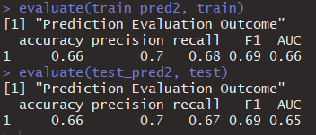
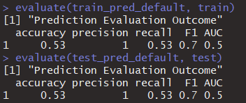
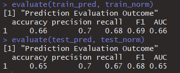
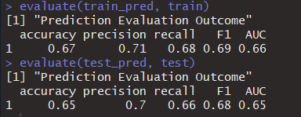

Writing code to do machine learning is easy. What makes it difficult is the optimisation. By large, there are two ways to optimise your model.<!--truncate -->

- Feature selection & transformation
- Model parameter optimisation

Both are hard-core topics and neither can be covered in this post. Feature selection and transformation often require subject matter expertise on top of statistical computation.

In this blog, I want to focus on parameter optimisation by using the power of the caret package. The caret package makes it easy to do hyper parameter search. The model parameter optimisation is often called hyperparameter optimisation. We search and optimise over all possible parameter values for the model and pick the ones perform the best (the best hyperparameter set).

Here are some of the commonly used for hyperparameter search strategies.

Grid Search (Not as efficient, but easy)
Random Search (Efficient in certain scenarios)
Bayesian Optimisation (Efficient in general)
The default search method for caret is grid search which will be used here. Another question is which parameters to search. This depends on the method or package you use.

### Neural Networks Hyperparameter Search

Neural networks has many different flavours. I chose the nnet package because it uses the often-called vanilla neural net (a.k.a the single layer back-propagation network or single layer perceptron) and is simpler to tune hyperparameters compared to other more complicated neural networks. In this method, you don’t need to determine the number of layers as it has only one. What you need to do is to choose the size of the neurons in the hidden layer.

The bigger neuron size you use, the more complicated the model become. Therefore, more neurons tend to become over-fitting. Of course, this is dependent on the dataset. It is only determined by experimentation. However, smaller size is a good rule of thumb.

Neural networks sound complicated and magical. But, if you deconstruct them, they are basically non-linear statistical model. Hence, we should try to optimise the regularisation parameter. `nnet` has a parameter called decay for regularisation. In short, regularisation prevent over-fitting by penalising over-fitted training models.

We will set hyperparameter ranges for size and decay for `nnet` optimisation.

**Sampling**

Another thing you have to consider is sampling. Again, there are a few different ways like Random Sub Sampling, Stratified Sampling or Cross Validation. In this example, I will use the classic k-fold cross validation method (where k = 10). A sampling method and parameters can be specified in the trControl parameter in the train function in caret.

K-fold Cross Validation split the training data into k pieces. Then, it uses k minus 1 folds to estimate a model and test it on the remaining 1 fold (called validation set) for each candidate parameter values. With grid search, it will calculate the average accuracy per parameter set to produce the best set.

The drawback of grid search is that you are assuming a possible range for the hyperparameter set. Therefore, you cannot reach it when it exists outside of your pre-defined set. But, it’s a good place to start.

**Dataset**

I am using the data set Online News Popularity Data Set from the UCI Machine Learning repository. The dataset was used in the publication here. Each row is an online news article containing a bunch of attributes as well as the numbers of social media shares. There are 58 features and what you predict is a binary classifier of the article, ‘popular’ or ‘unpopular’. The classification category was made by setting the threshold of 1400 shares. This number was chosen in the paper because it produced a balanced popular/unpopular class distribution (Fernandes et al. 2015). The goal is to predict if the article is popular or not by using the available features.

In the paper, they used Python’s `scikit-learn` to do Random Forest, Adaptive Boosting, Support Vector Machine, K_Nearest Neighbour and Naïve Bayes. We can use their results as a benchmark to test our neural networks model performance.

**Code**

(1) Install and import required libraries.

```R
library(caret)
library(nnet)
library(e1071)
library(NeuralNetTools)
library(doParallel)
library(ROCR)
```

(2) Download csv file here. Load the data and create a target field which contains a binary classifier(popular and unpopular). I used 1400 as the threshold as in Fernandes et al. 2015. I removed non-predictors according to the article.

```R
shares <- read.csv("/tmp/OnlineNewsPopularity.csv")
shares$Popularity <- as.factor(ifelse(shares$shares >= 1400, "popular", "unpopular"))
shares2 <- shares[, -c(1, 2, 61)
```

(3) Split the data set into training and testing with seed for repeatability.

```R
set.seed(1000)
inTrain <- createDataPartition(shares2$Popularity, p=0.7, list=F)
train <- shares2[inTrain, ]
test <- shares2[-inTrain, ]]
```

(4) Now, it’s time for training and predicting! You can set the sampling methods with the trainControl function and pass it as the trControl parameter in the train function. I defined the tuneGrid as 3 size and 3 decay options. The caret package will conduct the accuracy search to find the best combo. The final values used for the model were size = 1 and decay = 0.1 (you can see this by typing model_nnet in the console).

The caret package supports parallel processing. R by default uses only a single UPC. Parallel processing will enable you to do computation with all the CPUs in your computer. It is easy to set it up. For Windows, you need to use the doParallel package. Once you register the cores with the registerDoParallel function, caret will execute it automatically.

You can visualise the model by the plotnet function from NeuralNetTools.

```R
set.seed(1000)
# Set up Parallel Computing
cl <- makeCluster(4)
registerDoParallel(cl)

# Train with caret
numFolds <- trainControl(method = 'cv', number = 10, classProbs = TRUE, verboseIter = TRUE,
                         preProcOptions = list(thresh = 0.75, ICAcomp = 3, k = 5))

model_nnet<- train(Popularity~., data=train, method='nnet', trace=F,
                   preProcess = c('center', 'scale'), trControl = numFolds,
                   tuneGrid=expand.grid(.size=c(1,5,10), .decay=c(0,0.001,0.1)))

# Plot model and predict
plotnet(model_nnet)
train_pred <- predict(model_nnet, newdata=train, type="raw")
test_pred <- predict(model_nnet, newdata=test, type="raw")
Here are some notes for errors and warnings when you are training the model.

The linout parameter cannot be True. You will get the error message, ‘entropy fit only for logistic units’. The default value for linout is FALSE.
```

In trainControl(), summaryFunction=twoClassSummary will result in a warning: The metric “Accuracy” was not in the result set. ROC will be used instead.” This parameter can be omitted. It will use Accuracy by default for categorical prediction.

(5) In R, you can use confusionMatrix() to evaluate the model. It will give you the performance metrics such as accuracy, balanced accuracy, sensitivity, specificity and so on. I created a custom function for evaluation because accuracy, precision, recall, F1 and AUC were used in the paper and I wanted to get the same metrics for benchmarking.

```R
evaluate <- function(pred, actual){
  tab <- table(pred, actual$Popularity)
  tp <- tab[1,1]
  tn <- tab[2,2]
  fp <- tab[2,1]
  fn <- tab[1,2]
  accuracy <- (tp + tn)/(tp + tn + fp + fn)
  precision <- tp/(tp+fp)
  recall <- tp/(tp + fn)
  F1 <- 2*(precision*recall)/(precision+recall)

  actual_label <- ifelse(actual$Popularity=='popular', 1, 0)
  pred_label <- ifelse(pred=='popular', 1, 0)
  pred_OCR= ROCR::prediction(pred_label, actual_label)
  perf = performance(pred_OCR, 'tpr', 'fpr')
  plot(perf)
  AUC <- as.numeric(performance(pred_OCR, "auc")@y.values)
  print("Prediction Evaluation Outcome")
  eval <- as.data.frame(cbind(round(accuracy, 2), round(precision, 2), round(recall, 2), round(F1, 2), round(AUC, 2)))
  colnames(eval) = c('accuracy','precision','recall','F1','AUC')
  print(eval)
}

evaluate(train_pred, train)
evaluate(test_pred, test)

# Confusion Matrix from caret package for evaluation
# Only for accuracy
confusionMatrix(train_pred, train$Popularity)$overall[1]
confusionMatrix(test_pred, test$Popularity)$overall[1]
# confusion matrix and all the metrics
confusionMatrix(train_pred, train$Popularity)
confusionMatrix(test_pred, test$Popularity)
```

- Output




### Comparing It With Default NN Model

What if we used the model without any optimisation? Check out the outcome. It is pretty much as good as random picks. Now, you see the power of the simple caret optimisation!

```R
model_default <- nnet(Popularity~., data=train, size=1)
plotnet(model_default)

train_pred_default <- predict(model_default, newdata=train, type="class")
test_pred_default <- predict(model_default, newdata=test, type="class")

evaluate(train_pred_default, train)
evaluate(test_pred_default, test)
```



### Should We Normalise the Dataset?

It really depends on the data. The nnet package generally performs fine without normalisation unless you have features in completely different scale. Normalisation is usually recommended for Neural Networks for better accuracy and faster training speed.

Well, let’s test it. nnet takes factor and numeric values as features. In the first example, all field types are numeric. Here, I converted categorical variables into factors and normalised other numeric fields.

```R
# Normalising data
index <- c(12:17, 30:37, 59)
colnames(shares2[,index]) # checking the selected columns by index
tmp_df1 <- as.data.frame(scale(shares2[, -index]))
tmp_df2 <- lapply(shares2[, index], as.factor)
shares_norm <- cbind(tmp_df2, tmp_df1)

# create training and testing set. Use the partition created above
set.seed(1000)
inTrain <- createDataPartition(shares2$Popularity, p=0.7, list=F)
train_norm <- shares_norm[inTrain, ]
test_norm <- shares_norm[-inTrain, ]

# train & predict
set.seed(1000)
cl <- makeCluster(4)
registerDoParallel(cl)
numFolds <- trainControl(method = 'cv', number = 10, classProbs = TRUE, verboseIter = TRUE,
                         preProcOptions = list(thresh = 0.75, ICAcomp = 3, k = 5))

model_nnet_norm <- train(Popularity~., data=train_norm, method='nnet', trace=F,
                         preProcess = c('center', 'scale'), trControl = numFolds,
                         tuneGrid=expand.grid(.size=c(1,5,10), .decay=c(0,0.001,0.1)))

model_nnet_norm # The final values used for the model were size = 1 and decay = 0.

train_pred_norm <- predict(model_nnet_norm, newdata=train_norm, type="raw")
test_pred_norm <- predict(model_nnet_norm, newdata=test_norm, type="raw")

evaluate(train_pred_norm, train_norm)
evaluate(test_pred_norm, test_norm)
```

Testing accuracy is slightly worse. But, overall it is similar. I think it is still good to test on the normalised dataset when you are modelling with neural networks. Normalised data usually give us a different model. In this case, the final values used for the model were size = 1 and decay = 0.



Let’s Benchmark!

Here is the performance metric table from the paper (Fernandes et al. 2015). Our model has the same accuracy as AdaBoost and SVM. It preformed slightly worse then RF. We beat them in Precision (0.7). However, I don’t think our model is superior because we have quite low AUC compared to all the models in the paper. Overall, I am happy with what I got. You can really see what simple optimisation can make difference!


### Further Grid Search

My hyperparameter range for the size was (1, 5, 10) and 1 became the best hyperparameter. OK, 5 neuron was probably too over-fitting. But, Isn’t 1 neuron too simple? Surely, having a few extra neurons would lead to better performance? I decided to investigate it further by setting size range to (1, 2, 3, 4).

```R
set.seed(1000)
cl <- makeCluster(4)
registerDoParallel(cl)
numFolds <- trainControl(method = 'cv', number = 10, classProbs = TRUE, verboseIter = TRUE,
                         preProcOptions = list(thresh = 0.75, ICAcomp = 3, k = 5))

model_nnet<- train(Popularity~., data=train, method='nnet', trace=F,
                   preProcess = c('center', 'scale'), trControl = numFolds,
                   tuneGrid=expand.grid(.size=c(1,2,3,4), .decay=c(0.001,0.01,0.1)))
model_nnet
plotnet(model_nnet)
plotnet(model2)
train_pred <- predict(model_nnet, newdata=train, type="raw")
test_pred <- predict(model_nnet, newdata=test, type="raw")

evaluate(train_pred, train)
evaluate(test_pred, test)
```

The best hyperparameters turned out to be size = 4 and decay = 0.1. With these parameters, I didn’t see any improvement on test dataset prediction. I even observed the model was overfitting. Generally speaking, complex neural networks tend to overfit. This exercise somehow reminded me of Occam’s razor. By paraphrasing it, the simplest is the best given everything is the same. I think Occam’s razor is often sited in machine learning as the reminder that simpler is often better.

Performance for size = 4 and decay = 0.1 is below:



### Your Turn

Can we further optimise Neural Network model here by using different search or sampling methods?
R has other neural network packages like neuralnet or RSNNS. Do they perform better than nnet?
Check all the models supported by the caret package. We can basically do all the methods used in the paper. See if we can use these methods and benchmark against the results?

```R
library(caret)
names(getModelInfo())
```

Fun!

### Reference

Fernandes, P. Vinagre and P. Cortez. A Proactive Intelligent Decision Support System for Predicting the Popularity of Online News. Proceedings of the 17th EPIA 2015 – Portuguese Conference on Artificial Intelligence, September, Coimbra, Portugal (https://repositorium.sdum.uminho.pt/bitstream/1822/39169/1/main.pdf)
