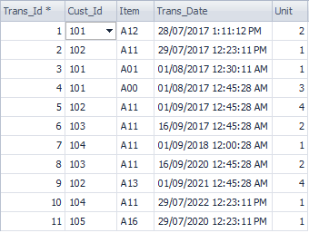
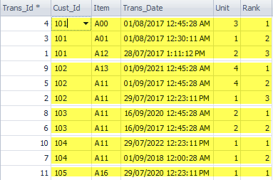
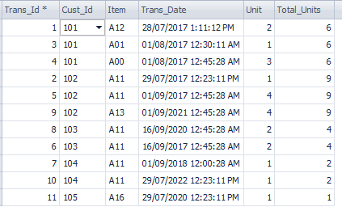
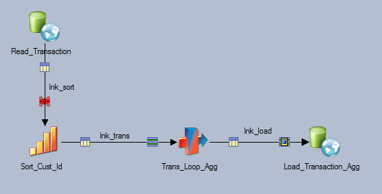
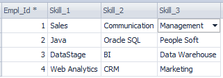
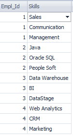
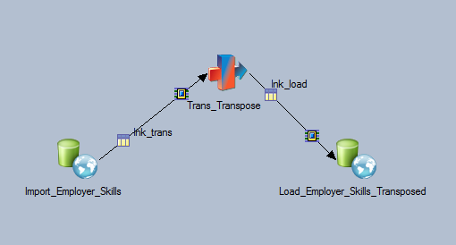

# Loop With Transformer

The Transformer stage has the built-in looping functionality where you can use Stage Variables and Loop Conditions to construct looping logics. In this post, we will present 3 different examples.

Ranking
Aggregation
Vertical Pivot
Before going into the examples, here are the useful variables for loop construction.

`@ITERATION` – System Variable to set the while loop condition. It starts from 1 and increments by one as the loop progresses. Once while loop breaks, it gets back to 1.
`SaveInputRecord()` – Utility function to save the current input row in the cache and return the count of records currently in the cache. Each input row in a group is saved until while loop breaks.
`GetSavedInputRecords()` – Output SaveInputRecord() value every time it loops. The output value can become ranking.
`LastRowInGroup()` – According to the grouping, True indicates the last row in the group.
Example 1: Ranking

In this example, we will add the rank columns that indicate the descending order of the transaction date per customer.

Input



Output



Steps


(1) Before the transformer stage, we need to sort the input data by Cust_Id in ascending order and Trans_Date in descending order.


(2) Set Hash as the inputs partition in the Sort Stage. Set Cust_Id as the hash key.


(3) Set the inputs partition in the Transformer stage to ‘same’. Make sure the perform sort is unticked.


(4) Set Stage Variables as below

```
svInput = SaveInputRecord()
svLastrowingroup = LastRowInGroup(Cust_Id)
svBreakloop = If svLastrowingroup then svInput Else 0
```

(5) Set Loop Condition as Loop While: `@ITERATION <= svBreakloop`

(6) Set Loop Variable as LoopVar = GetSavedInputRecord(). This LoopVar will become the Rank column.


Example 2: Aggregation

We will use the same data in Example 1 and create a column that has the total purchased unit count per customer.

Input

Same as Example 1

Output



Steps



(1) As in the example 1, we need to sort the input data by Cust_Id and set hash partition.

(2) Set Stage Variable as below. The order of the variables have to be kept. The key idea here is Stage Variables are executed from top to bottom. At the last row in the group, svSumUnits gets reset after the total unit is calculated as svTotalUnits.

```
svInput = SaveInputRecord()
svLastRowInGroup = LastRowInGroup(lnk_trans.Cust_Id)
svTotalUnits = if svLastRowInGroup then svSumUnits + lnk_trans.Units Else 0
svSumUnits = if svLastRowInGroup then 0 Else svSumUnits + lnk_trans.Units
svBreakLoop = if svLastRowInGroup then svInput Else 0
```

(3) Set the while loop condition as Loop While: `@ITERATION <= svBreakLoop`. You need to set `LoopVar= GetSavedInputRecord()`. Using SaveInputRecord() without GetSavedInputRecord() results in a compilation error.

(4) The stage variable svTotalUnits becomes the total units.


Example 3: Vertical Pivot

In the final example, we use the while loop in the transformer stage to perform vertical pivoting operation. Input records show employers and 3 columns that list their skill set. We will vertically transpose this table to list employers’ skill set in a single column as in the output.

Input



Output



Steps



(1) Set the while loop condition as `@ITERATION <= 3`.

(2) Set Loop Variable as below. Each iteration will add empl_id, and skill column 1, 2 or 3 according to the iteration variable (`@ITERATION`).

`loopVar: If @ITERATION = 1 Then lnk_trans.Skill_1 Else If @ITERATION = 2 Then lnk_trans.Skill_2 Else lnk_trans.Skill_3`


(2017-09-30)
