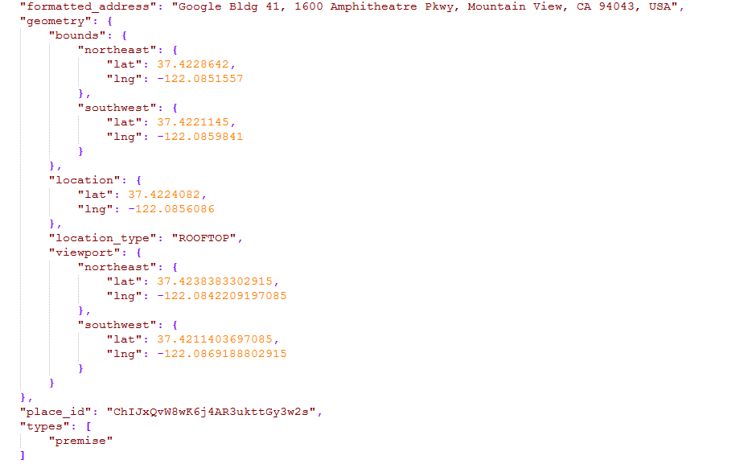
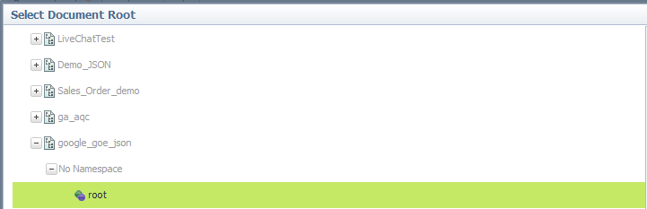
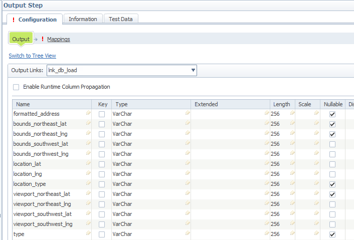
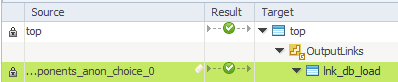
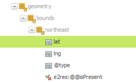
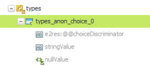
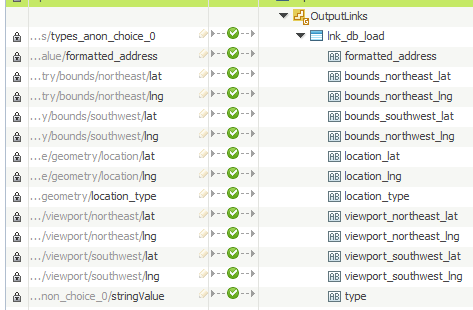
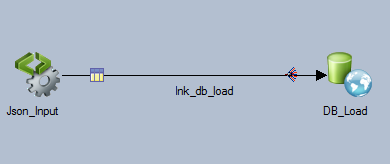

# Hierarchical Data Stage Transforming JSON Data

Hierarchical Data Stage can parse, compose and transform hierarchical data such as JSON and XML. In this example, we are using the JSON file obtained from Google Geocoding API. Geocoding API turn addresses (1600 Amphitheatre Prakway Mountain View CA) into geographic coordinates (latitude: 37.422, Longitude: -122.085 etc) . The outcome can be obtained as a JSON or XML format. After obtaining a JSON file, we will convert it to a flat table structure with DataStage.

To do the same transformation with Informatica Cloud, check out this post: How To Use Hierarchy Parser To Transform JSON File.

JSON File to transform



Transformed Table


Python Code to call API

```python
import requests
import json

url = 'https://maps.googleapis.com/maps/api/geocode/json?address=1600+Amphitheatre+Parkway,+Mountain+View,+CA&key=<yourAPIkey>'
req = requests.get(url)
res = req.json()

pretty = json.dumps(res, indent=4)
f = open('./demo_google_geo.json', 'w')
f.write(pretty)
print('Successfully Exported the data')
```

Steps

(1) Drag Hierarchical Data Stage onto the canvas. Open it and click ‘Edit assembly’.


(2) DataStage needs to know the schema of the JSON file that you are transforming. To add JSON schema, go to the Libraries tab in the Assembly Editor, click New Library and import the JSON file.


(3) Go back to the Assembly Editor tab. Click ‘Palette’ and add ‘JSON Parser Step’ between Input Step and Output Step.


(4) In JSON_Parser Step, select the file path for the JSON file in the Configuration tab.


(5) In the ‘Document Root’ section, you need to choose the ‘root’ from the JSON library entry you just created from step (2) (in this example, google_goe_json).



(6) Go to ‘Output Step’. Add column name and data type.



(7) Go to ‘Mapping’. As the parent node, map address_components_anon_choice_0 to lnk_db_load as below.



(8) Map all the values except ‘type’



(9) To map ‘type’, go back to the mapping of parent node (see step 7) and remap types_anon_choice_0 into lnk_db_load. Without remapping the parent node, you cannot map the value for ‘type’ and get the error below.

CDIUI2820E The mapping is not applicable to do an invalid type coversion or difference in the source and target list dimensions.

(10) Choose stringValue as blow for type.



(11) Once mapping is completed, press OK.



(12) Connect to the DB Load stage and Load the data.



(2017-08-21)
