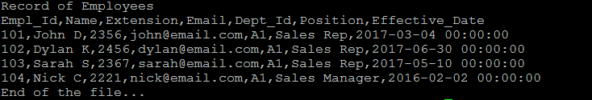
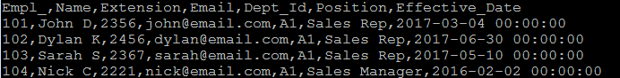
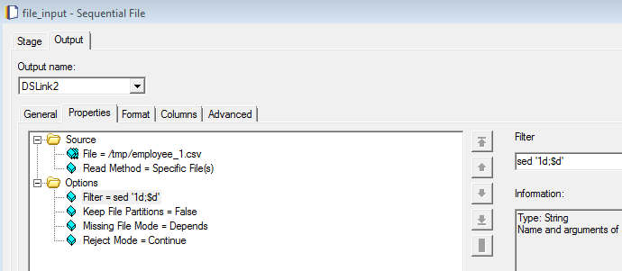
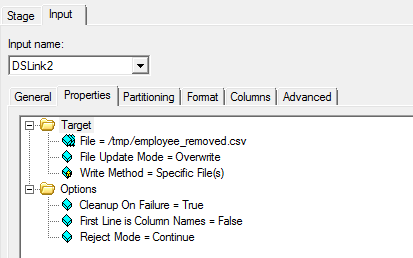
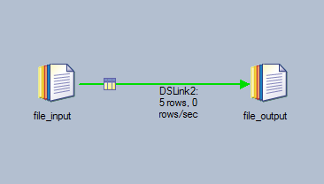

# Remove Leading & Trailing Lines in Flat File

When flat file has leading and trailing lines that are not part of the table, we can use the filter in the flat file stage to remove them.

As an example, the file below has a leading and trailing lines. We want remove them with the flat file stage.

Output

Steps

(1) Under the option, add the unix command, sed `‘1d;$d’` in the Filter.

(2) Configure the output flat file stage.

(3) Run the job.

(2017-09-30)
