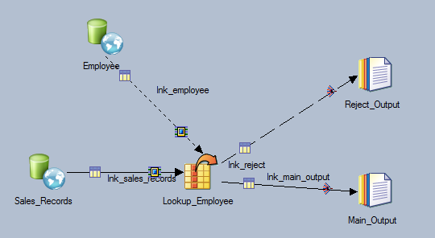
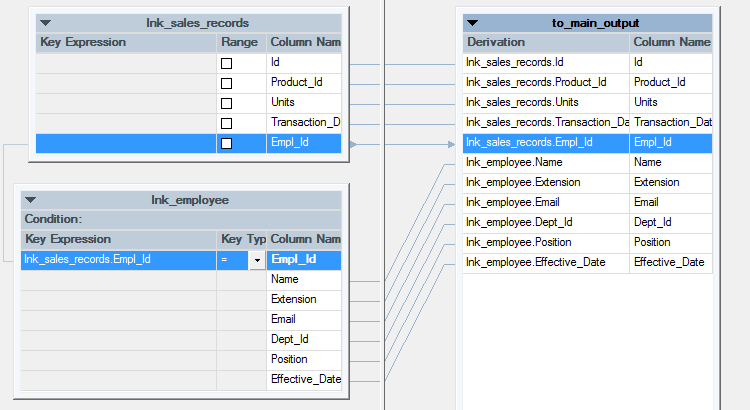
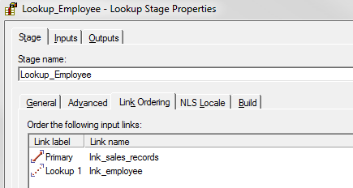
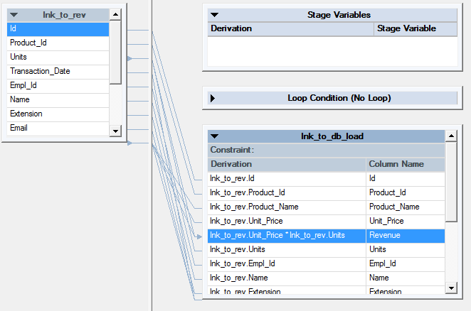
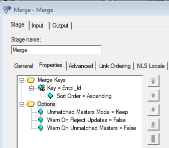
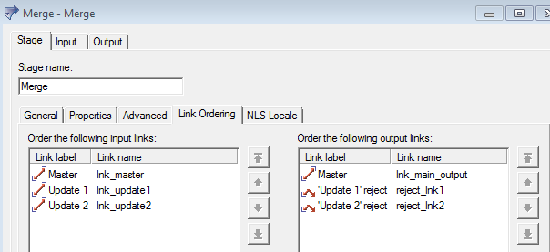
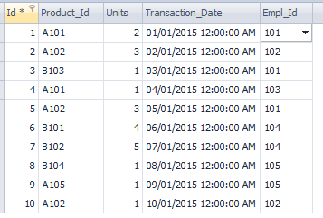
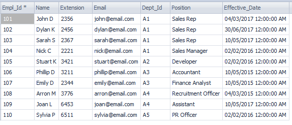

# Join vs Lookup vs Merge

DataStage has three processing stages that can join tables based on the values of key columns: Lookup, Join and Merge. In this post, we discuss when to choose which stage, the difference between these stages, and development references when we use those stages.

Use the Lookup stage when:

Having a small reference dataset.
Doing a range lookup.
Validating a row (If there is no corresponding entry in a lookup table to the key’s values, you can output the row in the reject link).
Use the Join stage when:

Joining large tables (you will run out of RAM with the Lookup stage).
Doing outer joins (left, right, full outer).
Joining multiple tables with the same keys.
Use the Merge stage when:

Multiple update and reject links are needed (e.g. Combining a master data set with one or more update datasets)
Let’s discuss each stage in details.

Lookup Stage

Key Points

The Lookup stage has a reference link, a single input link, a single output link and a single rejects link.
It does not required data on the input link or reference link to be sorted.
Lookup stage is a in-memory processing stage. Large look up table will result in the job failure if DataStage engine server runs out of memory.
The Key column names in main and lookup tables do not need to be the same as you map them in the stage.
Make sure to select the right Lookup Stage Conditions (see Example step 3).

Development Reference

In this example, we will add employees’ information to the sales record by joining two table by the key columns, Empl_Id

(1) Map the key column and map the output in the Lookup stage.

(2) Select Lookup Stage Conditions to specify the actions when Lookup condition is not met and Lookup fails.

There are 4 options: Continue, Drop, Fail and Reject.

Continue: When the lookup table does not have the value appears in the main table, it will assign null values to the lookup table columns. In another word, this option works like Left Join.
Drop: When the lookup table does not have the value appears in the main table, it will drop the row all together. In another word, this option works like Inner Join.
Fail: When the lookup table does not have the value appears in the main table, the job will fail. This is the default option for the Lookup stage.
Drop: When the lookup table does not have the value appears in the main table, it will output to the reject output (as in this example).

(3) Make sure you have the correct link order.

(4) Input partitioning usually works with ‘Auto’.

Join Stage

Key Points

The key columns must be the same name between tables.
It can have multiple input links (as long as table has the same key columns between them) and a single output link.
The performance of Join can be improved by key-sorting data on input links (‘Auto’ partitioning mode is usually fine).
If the reference dataset is small enough to fit in RAM, it is faster to use Lookup.
There are four join options: inner join, left outer join, right outer join and full outer join.
We need to make sure input links are in the right order. This can be set from Stage -> Link Ordering.

Development Reference

In this example, we join Employee and Products tables to Sales_Records based on Empl_Id and Product_Id. Then, calculate the revenue by multiplying the price column from Products by the number of units sold.

(1) In each join stage, make sure to choose join key and type (Left outer, right outer, full outer, etc).

(2) Make sure the link order is correct.

(3) Partition can be ‘Auto’.

(4) Transformer Stage to calculate revenue by multiplying Unit_Price by Units. Note that the data type for Units is integer and Unit_Price is double. Therefore, set the Revenue’s data type as double.

Merge Stage

Key Points

The Merge stage can have any number of input links, single output links and the same number of reject output links as the update input links.
A master record and an update record are merged only if both of them have the same values for the specified merged key. In another word, merge stage does not do range lookup.
To minimise memory requirements, we can ensure that rows with the same key column values are located in the same partition and is processed in the same node by partitioning. However, the ‘auto’ option for partitioning usually works fine.
As part of preprocessing, duplicate records need to be removed from the master. If there are more than one update data sets, it only updates the first record as below.

Development Reference

In this example, updating Master_Sales_Records with employee information from 2 reference Employee tables.

(1) Merge stage has only 3 options, Unmatched Master Mode, Warn On Reject Updates and Warn On Unmatched Master. All the tables must have the same column names for the merge keys.

(2) Configure input and output links. Map them to the right link order.

Reference Datasets

Sales_Records

Employee

Joined

(2017-09-30)
