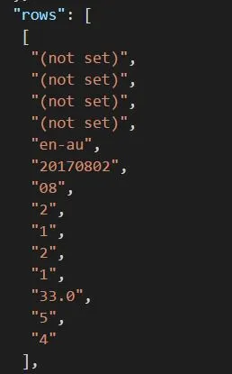
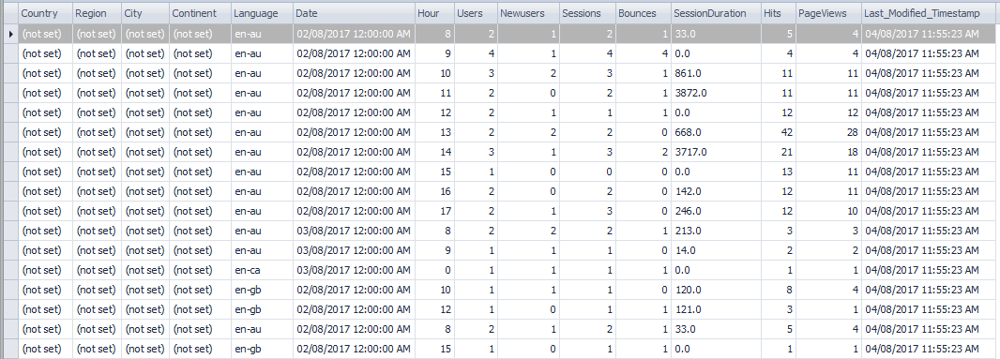
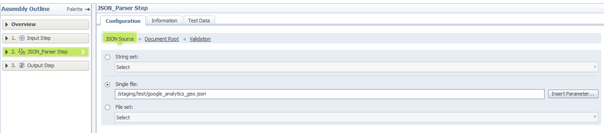
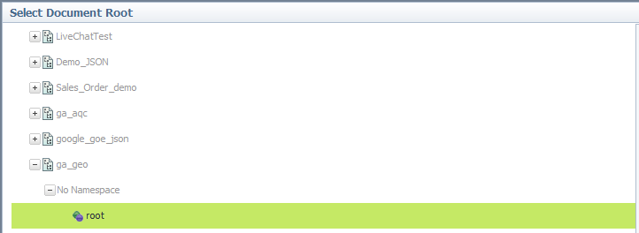
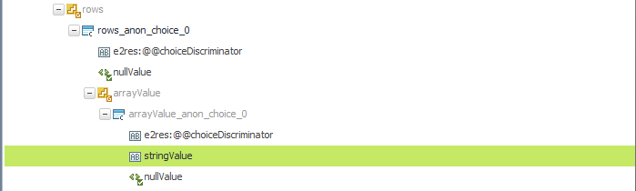

# Hierarchical Data Stage Transforming Google Analytics Data

By using Google Analytics Core Reporting API, we can export reports from Google Analytics. To export reports, you need to specify dimensions and metrics. To further explore GA reports, you can use Query Explorer.

In this example, we exported the data using the following dimensions and metrics around geographical information of the visitors. As the datetime grain, we used date and hour.

Dimensions: `ga:country, ga:region, ga:city, ga:continent, ga:language, ga:date, ga:hour`

Metrics: `ga:users, ga:newusers, ga:sessions, ga:bounces, ga:sessionDuration, ga:hits, ga:pageviews`

The JSON data from GA has metadata (including column names) and actual data (coming as ‘rows’). The order of the rows can be mapped to the order of ‘columnHeaders’ in the JSON file.

‘rows’



‘columnHeaders’


We will take the data from the ‘rows’ node and convert it to the structured table with DataStage.

Output



You need to set up Google Analytics API. It requires the p12 key file and service email. The example below uses API version 3. The code below is based on the Google Analytics API Tutorial. The code obtains one day worth of data. Make sure to set max_result = 10000 in order not to miss out all the data.

```python
import os
import json
from apiclient.discovery import build
from oauth2client.service_account import ServiceAccountCredentials
import httplib2
from oauth2client import client
from oauth2client import file
from oauth2client import tools

key_file_path = "your_dir_path/your_key_file.p12"
service_email = "your_service_email"
scope = ['https://www.googleapis.com/auth/analytics.readonly']
api_name = 'analytics'
version = 'v3'
# Create a service

def get_service():
    '''It uses credential to connect to GA Reporting API.
    It returns the service object to execute bulk report export.'''
    credentials = ServiceAccountCredentials.from_p12_keyfile( \
        service_email, key_file_path, scopes=scope)

    http = credentials.authorize(httplib2.Http())
    # Build the service object.
    service = build(api_name, version, http=http)
    return service

def get_ga_id(ga_service, acc_num = 0, prop_num = 0, view_num = 0):

  print("Using the following settings:\n")

  try:
    acc = ga_service.management().accounts().list().execute().get('items')[acc_num]
    acc_id = acc.get('id')
    print("Google Analytics account: " + acc.get('name'))

  except:
    print("Error finding account")
    return None

  try:
    prop = ga_service.management().webproperties().list(accountId=acc_id).execute().get('items')[prop_num]
    prop_id = prop.get('id')
    print("Property name: " + prop.get('name'))
  except:
    print("Error finding property")
    return None

  try:
    view = ga_service.management().profiles().list(accountId=acc_id,webPropertyId=prop_id).execute().get('items')[view_num]
    view_id = view.get('id')
    print("Analytics view name: " + view.get('name') +"\n")
  except:
    print("Error finding view")
    return None

  return view_id


def fetch_and_dump(ga_service,ga_id):
  # Google Analytics metrics we want
  ga_metrics = 'ga:users,\
                ga:newusers,\
                ga:sessions,\
                ga:bounces,\
                ga:sessionDuration,\
                ga:hits,\
                ga:pageviews'

  dims_date = ',ga:date,ga:hour'

  # Sets of dimensions to look at
  ga_dims_geo = 'ga:country,\
                 ga:region,\
                 ga:city,\
                 ga:continent,\
                 ga:language'+dims_date

  data_geo = ga_service.data().ga().get(ids='ga:'+ga_id,start_date='yesterday', end_date='today', max_results=10000, metrics=ga_metrics, dimensions=ga_dims_geo).execute()
  file = open('your_file_export_dir_path/google_analytics_geo.json','w')
  file.write(json.dumps(data_geo, indent=1))
  print("Export successfully completed!")

# Run code
my_service = get_service()
my_id = get_ga_id(my_service)
fetch_and_dump(my_service, my_id)
```

Steps


(1) First of all, we need to configure Hierarchical Data Stage. Open the stage and click ‘Edit assembly…’.


(2) We need to add the JSON schema to the stage. Click the Libraries Tab, create a new library and upload the JSON file from your computer.


(3) Go back to the Assembly Editor tab. Click ‘Palette’ and drag JSON_Parser Step between Input Step and Output Step.


(4) Go to JSON_Parser Step and add the file path under the JSON Source tab.



(5) Select Document Root from the library for GA data.




(6) Go to Output Setup. In the Output, we add one column called array with varchar(1000).


(7) Map ‘stringValue’ to the column, array.




(8) In the Transformer stage, use Looping Condition to add the @Iteration variable as column_count.


(9) Drag Enterprise Pivot Stage and perform vertical pivot. Make sure to set pivot type = vertical. Set Array Size = 14 and pivot the array column with grouping by column_value.


(10) Grab another Transformer Stage and rename the column in the same order as the column headers in the JSON file. Change the data type. In the transformer, varchar to integer conversion can be done without function. To convert the Date column, use the StringToDate() function.


(11) Load the table


(2017-08-21)
