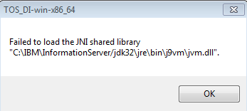
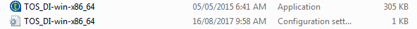

# How To Resolve ‘Failed to load the JNI shared library’ Error

When you try to open Talend application, you might get the error message below. Let’s resolve it.

```bash
Failed to load the JNI shared library “C:\IBM\InformationServer/jdk32\jre\bin\j9vm\jvm.dll”.
```



Talend (both free and licensed) requires Java 1.8. If you still have Java 1.7, you need to upgrade it to 1.8 and set the Java_Home path to the new version.

When you install IBM DataStage, it sets the JRE path to its own Java JRE on version 1.7. The error happens because any Eclipse-based application like Talend tries to use the default JRE path even when your computer only has 1.8 Java. To override the default path, you need to add a few lines. in the configuration setting (Talend-Studio-win-x86_64.ini or TOS_DI-win-x86_64.ini) file.

```bash
-vm
C:\Program Files\Java\jdk1.8.0_101\bin\javaw.exe
-vmargs
-Dosgi.requiredJavaVersion=1.8
```

The config file has the same name as the application. It is found here:



How can I find my JER path?

Here are the steps for finding the JER path on your computer (Windows)

(1) Type Java in the search

(2) Choose ‘About Java’ or ‘Configure Java’

(3) Once you go into Java Control Panel, hit the Java tab and click ‘View’.


(4) You will see your JREs. You can copy and paste the right path into the Talend config file.


(2017-08-16)
