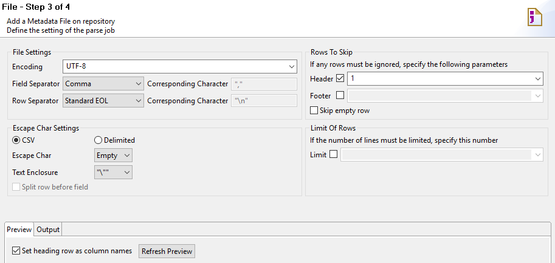
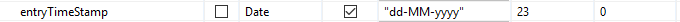
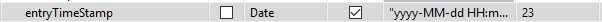
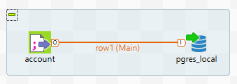
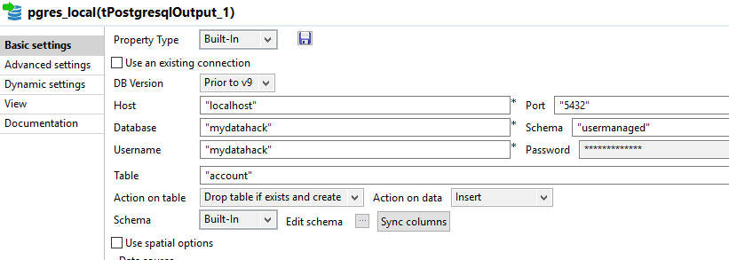

# Tips and Troubleshooting For Uploading CSV to Database In Talend

There will be time when you want to upload a big csv file (with many rows and hundreds of columns) to a relational database table. Talend Open Studio is an open source ETL tool that I use regularly to do odd jobs like that. I like using it because it infers the schema and create database table. You can build and execute the job on your desktop. If you know a few tricks, it becomes very easy and satisfying. This post include tips and troubleshooting guide to ingest a csv file to a database. Let’s have a look.

Scenario

We have a relatively large csv file with over 150 columns and 100k rows with mixed data types (text, numeric, Boolean, and timestamp). We would like to create a table and upload the data there in Postgres.

The file is in the classic double quoted and comma separated format.

Steps

(1) Create File delimited connection under Metadata and define the file format.

Choose field separater as comma and Text Enclosure as double quote. Skip the first row and set heading name as column name.



(2) Edit the schema

Timestamp

Talend infers the schema from the file. For some reason, timestamp fields is always set to Date with dd-MM-yyy as default. If this is a timestamp field you need to change the format as in the file (such as yyyy-MM-dd HH:SS:MM).

Default



Update



String

From a flat file, Talend infers the character length from a limited number of rows. If your file has many rows, the length may be incorrectly inferred.

The classic example is that you may have a string with length 0 because the first few rows has no data in it. There is no varchar with 0 length and it will result in error.

If you need to check the max character length of a specific column quickly, you can use this Python code. It basically find the max length for each column and make it into a DataFrame.

```python
import pandas as pd

df = pd.read_csv('/tmp/account.csv')

def max_char_len(df):
columns = df.columns.get_values().tolist()
max_len = list()
for column in columns:
length = int(df[column].astype(str).str.encode(encoding='utf-8').str.len().max())
max_len.append(length)
col_len_df = pd.DataFrame({'Column':columns, 'Max_Length':max_len})
return col_len_df

varchar_ref = max_char_len(df)

print(varchar_ref.loc[varchar_ref['Column'] == 'myStatus'])
```

Numeric

If you want to define a numeric value, schema inference doesn’t really work. You need to define it by yourself.

(3) Drag the metadata into the canvas and set it as tFileInputDelimited.

(4) Create a Postgres Db Connection under Metadata and Drag to the canvas as tPostgresqlOutput.

Make sure to connect input to output.



(5) Configure Db output.

Add table name. Set Drop table if exists and create as Action on table and Insert as Action on data. Hit Sync columns.



Common Errors

org.postgresql.util.PSQLException: ERROR: length for type varchar must be at least 1

As discussed in step 2, empty column may be inferred as string with 0 length. Database usually doesn’t allow it. Edit the schema with the appropriate character length.

ERROR: value too long for type character varying(1)

Talend only infers column length from a limited number of rows when it comes to a flat file. You need to edit the schema with the right char length.

org.postgresql.util.PSQLException: ERROR: zero-length delimited identifier at or near “”””

You will get this error if you forgot to add a target table name in the postgres output stage.

You are an expert now!
