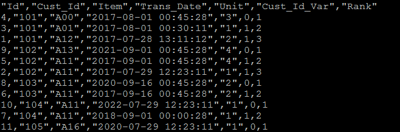
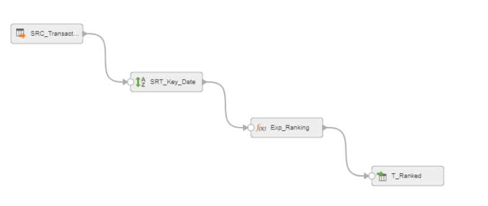

# How To Do Ranking

Informatica Cloud does not have Rank Transformer as the Power Center (it is said to be coming in the first quarter of 2018). However, we can use Expressions to elegantly execute the rank transformation according to the specified columns. This is very similar to removing duplicates. It uses the concept that Informatica expressions follow the expression positions to execute them.

We have a transaction table where we need to pick the latest customer transaction records (if the customer did multiple transactions). To pick the latest record, we will sort the table by Cust_Id and Trans_Date and rank them within the same Cust_Id.

Source Table

Outcome

Steps

(1) Configure Source from the flat file (see here for more details).

(2) Sort Records by Cust_Id in Ascending Order and Trans_Date in Descending Order.

(3) Configure Expression

Here are the detailed explanation on how the expressions work.

The very first row

v_cust_id is 0 because v_prev_cust_id is not executed yet. Hence, v_rank is 1.

The second row

v_cust_id is 1 because v_prev_cust_id is 101 and Cust_id is also 101. Hence v_rank is 1 (v_rank from the previous row) + 1.

The third row

v_cust_id is 1 because v_prev_cust_id is 101 and Cust_id is also 101. Hence v_rank is 2 (v_rank from the previous row) + 1.

The fourth row

v_cust_id is 0 because v_prev_cust_id is 101 and Cust_id is 102. Now, v_rank is reset to 1 according to the expression.

The fifth row

v_cust_id is 1 because v_prev_cust_id is 102 and Cust_id is also 102. Now, v_rank is incremented to 2 (1 + 1).

and so on.

(2017-08-12)
