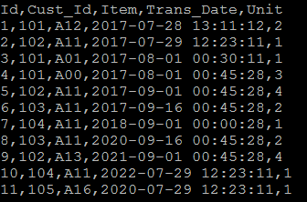
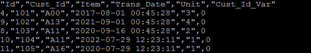
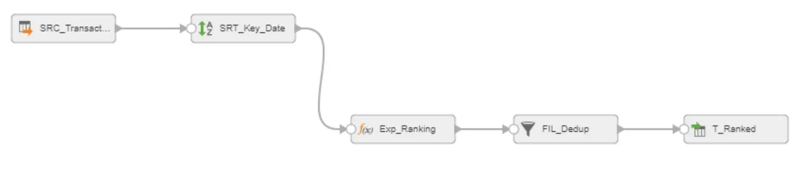

# How To Remove Duplicate

Informatica Cloud does not have a remove duplicate stage where we can remove duplicate according to the specified column values. However, we can remove duplicate elegantly by using Sort and Expression Transformation.

The most important concept about expressions is that Informatica follows the expression position to execute them.

We have a transaction table where we need to pick the latest customer transaction records (if the customer did multiple transactions). To pick the latest record, we will sort the table by Cust_Id and Trans_Date and take the first record.

Source Table

Outcome

Steps

(1) Configure Source from the flat file (see here for more details).

(2) Sort Records by Cust_Id in Ascending Order and Trans_Date in Descending Order.

(3) Create Expressions: Informatica follows the expression position to execute them.

For the first row loaded from the source, v_prev_cust_id is null as the second expression hasn’t been executed and the v_cust_id becomes 0. Then, the second row, v_prev_cust_id is set to 101 and v_cust_id becomes 1. When the new record comes, v_cust_id becomes 0 as it is different from v_prev_cust_id.

In order to select the top record, we simply need to get the records where v_cust_id is 0.

(4) Filter the records.

(2017-08-12)
