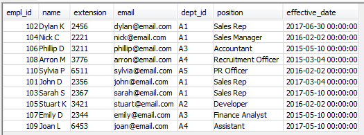
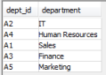

# How To Implement Type 1 & 2 SCD

Capture Stage would be a good approach for SCD with Informatica Cloud.

We added extra fields in the dimension table, start_date (to indicate effective date for type 2 columns), end_date (1999-12-31 00:00:00 as default), current_row_flag (to indicate which record is current), hash_key_type1 (to capture changes in type 1 columns), hash_key_type2 (to capture changes in type 2 columns), last_modified_timestamp (this is to indicate the last loaded timestamp).

Employee Source

Department Source

Employee Dimension

Steps

(1) Join Employee and Department with a custom query in the Source.

(2) Add hash values for type 1 & 2, Last_Modified_Timestamp, Current_Row_Flag and End_date into the Source Table.

(3) Read Employee Dimension Table.

(4) Make sure to take only the ones with Current_Row_Flag = ‘Y’

(5) Join Source and Target Table by the business key (Empl_Id).

(6) Compare Hash Keys and create Change Capture Values.

(7) Use Router Transformation to separate the records according to the change capture value.

(8) Map the output.

(2017-08-12)
