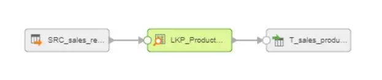
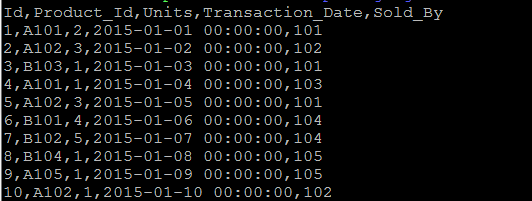

# How To Use Lookup

In Informatica, Joiner and Lookup can both join tables according to the join keys. What are the difference between Joiner and Lookup?

**Joiner**

- Active Transformation
- The query cannot be overridden
- Works only for equal conditions
- Can do outer join
- Can use only as Source
- Multiple matches return all matching records
- No configuration option for persistence cache, shared cache, uncached, and dynamic cache

**Lookup**

- Passive Transformation
- The query can be overridden
- Support equal and range conditions
- Cannot perform outer join
- Can use as Source and Target
- Multiple matches can be configured to return first, last, any or error values
- Configuration option for persistence cache, shared cache, uncached, and dynamic cache
- Perform Lookup on its own (unconnected lookup)
- Let’s have a look at an example of Lookup Transformation by using the same data as Joiner Example.

We use Sales_Record as a master table and look up product name and unit price from Products.

Sales_Record

Product

Steps

Configure Sales_Record as a source. For flat file connection, see here.

The lookup table (Product) is configured inside the Joiner transformation.

As Joiner, column names have to be different. To resolve field name conflict, we added src\_ prefix in Sales_Record. The operator for the condition can be a range or equal.

Run the mapping, then we;ll get this.

(2017-08-09)
