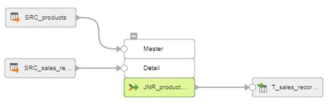

# How To Join Tables With Joiner

This page explains how to join tables in Informatica Cloud with Joiner.

In this example, we are adding Product Name and Unit Price to Sales_Record from Products by Product_Id.

Sales_Record

Products

Steps

1. Configure flat file connections to read both Sales_Records and Products. For flat file connection, see here.

2. Product is set to Master and Sales_Record is set to Detail. In this case, using Master Outer will left join Products to Sales_Record. In Informatica, Join Type can be confusing. Here are the details.

Master Outer keeps all rows of data from the detail source and matching rows from the master source. It discards the unmatched rows from the master source.

Detail Outer keeps all rows of data from the master source and the matching rows from the detail source. It discards the unmatched rows from the detail source.

Normal discards all rows of data from the master and detail source that do not match, based on the condition

Full Outer keeps all rows of data from both the master and detail sources.

3. In Informatica, tables cannot have the same column name and we need to add prefix or sufix to bulk change the name.

4. Configure Output. We will make a file at runtime.

5. Run the mapping and the table is joined 🥳.

(2017-08-09)
