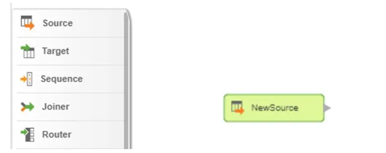
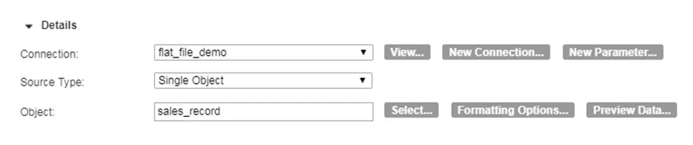
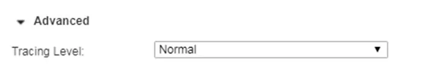
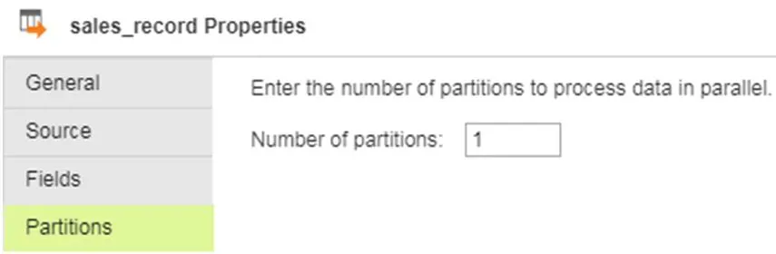

# How To Read Flat Files

This page explains how to create a connection to a directory from which you can read flat files in Informatica Cloud.

(1) How to create a connection to a directory

- Go to the Conftion Tab and choose ‘Connection’

- Add parameters (Connection Name, Type, Runtime Environment, Directory, Data Format and Code Page)

(2) How to Configure Source in the Mapping

1. Go to Mappings and drag the Source stage into the canvas.

2. Rename the Source

3. Add connection. To read a specific flat file, choose Single Object as Source Type and select the source object

4. (Optional) Under Advanced, we can set Tracing Level (Terse, Normal, Verbose Initialization, Verbose Data). This will determine what information goes to the session log file.

5. Default data type for the flat file is string. We can edit the metadata. In this example, Transaction_Date is changed to datetime and Id is changed to integer.

6. (Optional) We can also set the number of partitions to process data in parallel.

(2017-08-09)
