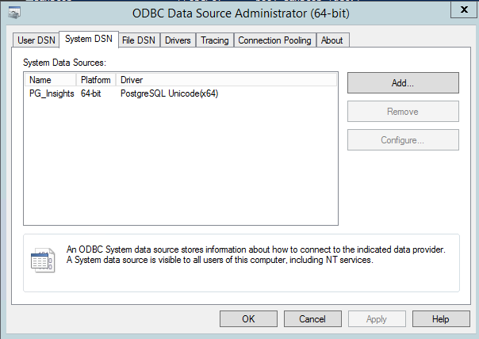

# How To Configure ODBC Connector For Informatica Cloud Secure Agent

Informatica does not have a dedicated Postgres database connector. Therefore, we need to use the ODBC connector. In this post, I will discuss how to configure Postgres ODBC in both Linux and Windows servers for the Informatica Cloud ODBC connector.

Linux Server (Red Hat)

There are a few instructions, but none of them is clear and it took me a while to figure it out. The steps below works fine.

(1) Install 64-bit postgres ODBC in `/usr/lib64/` (see details here).

(2) Edit /etc/odbc.ini as below. Note that the Data Source Name (DSN) is the one in [].

```
[datalake]
Description = PostgreSQL connection to insightsdb
Driver = /usr/lib64/psqlodbc.so
Database =
Servername =
UserName =
Password = Port = 5432
Protocol = 9.3
ReadOnly = No
RowVersioning = No
ShowSystemTables = No
ConnSettings =
```

(3) Check if ODBC is working with isql command.

isql datalake
(4) Add these two variables in .bash_profile of the user under which the secure agent is running.

```bash
Sudo -su
Vi ~/.bash_profile
#Then add two variables below

export ODBCINI="/etc/odbc.ini"
export LD_LIBRARY_PATH="/usr/lib64/psqlodbc.so"
```

(5) Restart the secure agent.

```bash
/opt/infaagent/apps/agentcore/infaagent shutdown
/opt/infaagent/apps/agentcore/infaagent startup
```

Windows Servers

Configuring ODBC in a Windows Server is a relatively easy task because you can do it with the GUI tool. You can use the 64-bit version of ODBC Data Source Administrator just like you do it with your Windows desktop.

There are two things you need to know.

ODBC Data Source has to be configured as System DSN.
Choose Unicode, if the database server charset is set to UTF8.
Here is what it looks like.



(2017-11-11)
