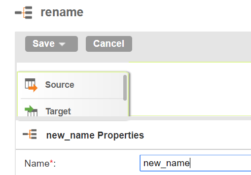

# How To Rename Mapping Job In Informatica Cloud

Mappings are where all the magic happens in Informatica Cloud. When I started using it, it took me a while to work out how to rename a mapping job. Since then, a few people asked me the same question. So, I decided to write about it. This is probably the shortest entry in my blog. But, I think it is worthwhile to document it.

When you click the existing mapping job, you will first see the Properties with Name. Once you retype the name in the field, you need to press ENTER before you save it.

Yeah, that’s it. You just need to press ENTER. Otherwise, the name won’t change.

Short and easy, but important.

(2018-02-07)
