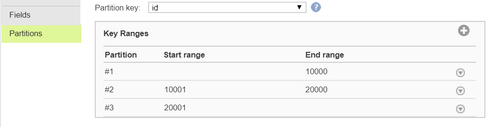

# How To Optimise Joiner Performance In Mapping Designer

Joiner is the stage to join tables in Informatica Cloud (see a quick introduction for Joiner Transformation here). If you have a large volume of data, the joiner transformation becomes very slow without performance optimisation. In this post, we will show you a few tricks that you can use to speed up your join.

(1) Perform joins in a database

When your tables are in the same database, it is better to use the database engine to join tables. Instead of pulling data from individual tables, you can write a custom query in the Source stage.

You can also specify to run the entire mapping jobs in a database by push-down optimisation, which can be configured in the mapping configuration task as an advanced session property.

(2) Optimise the master source designation

If your tables are in separate databases, it is hard to perform join in a database. The best practice is to assign the master source with fewer rows and fewer duplicate keys.

Joiner works by checking each row of the detail source against the master. Therefore, the more rows you have in master, the more iterations of the join comparison is needed, leading to slower performance.

Duplicate keys in the master increase the rows to be cached. Joiner performance is better when it has less rows to cache.

Speaking of caching, make sure to have enough disk space for caching in runtime environment, especially if you have a large volume of data.

(3) Use Partitions at Source

If you are getting single tables prior to joining, you can use the patitions property to enable parallel processing. It is faster to process small chunks of data in different CPUs in parallel. All you need to do is to set the key ranges in the join key of all the tables that are to be joined. Make sure to have all the tables have the same key ranges. I usually keep the start range of the first partition and the end range of the last partition empty. Informatica works out minimum and maximum for you and it somewhat feels safter just in case I miss any value.

This only works when you select a single table at source. If you are using custom queries, sorting is the way to go.

(4) Sorting keys before Joiner Transformation

Patitioning data does not work with custom queries. If you are joining tables that are generated from custom query, you should sort the input by Sorter prior to a join operation.

Sorted data decreases disk input and output in Joiner. With sorting, you will see the tangible performance improvement especially if you have a large data.

This can be tricky and can create incorrect join. First of all, both properties in the master and details have to be the same. Then, you have to set the advanced properties to match the Sorter properties in Joiner.

Let’s have a look at an example.

We have the detail source that has a lot of records and we want to add status from a look up table (the master source) based on the id of the detail.

In Sorter, I set the id field from the detail to be sorted in ascending order with the Null Treated Low option. I also set the id field from the detail in ascending order with Null Treated Low.

In Joiner, you have to match the sorting condition of each sorter.

Set null ordering in master and detail to Null is Lowest value.
Make sure to tick Sorted Input
Master Sort Order has to be Auto. If you set it to Ascending or Descending, you will not get the lookup value after joining.
You can increase the cache size if you have a large volume of data.

Performance optimisation in ETL is fun. I get so much kicks out of it! If you know any tricks, let us know!

(2018-01-19)
