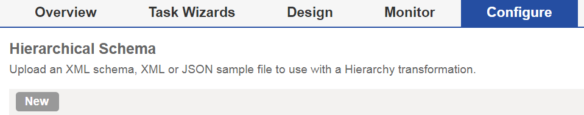
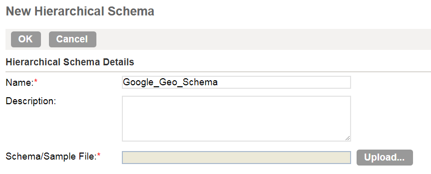
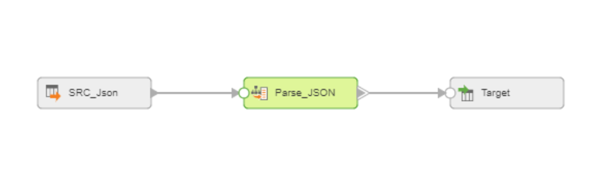
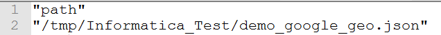
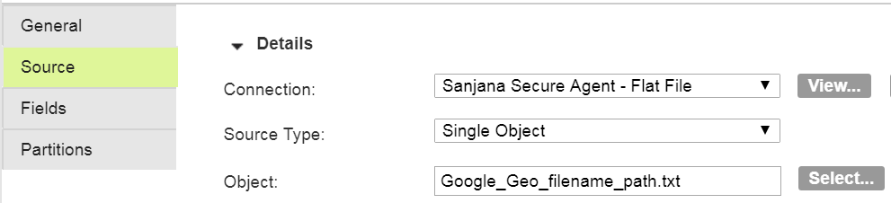
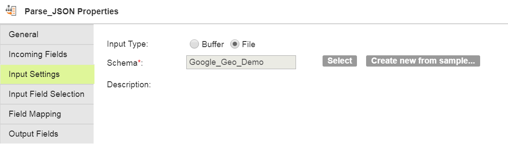
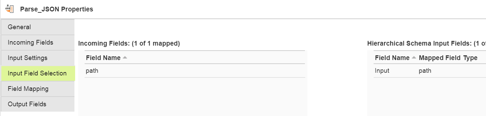
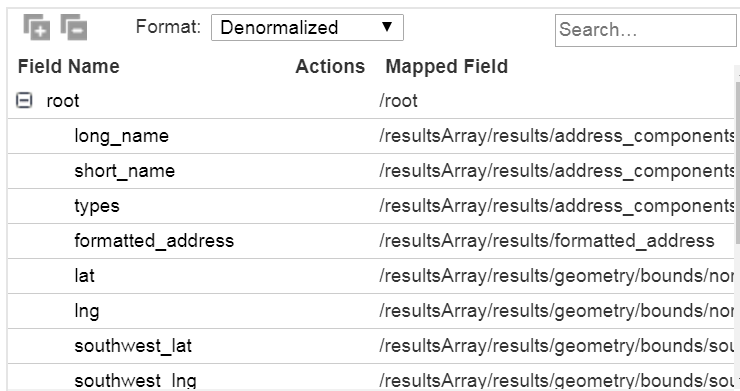
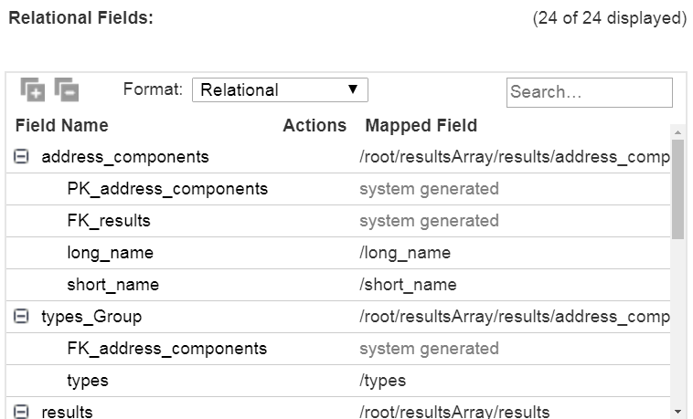

# How To Use Hierarchy Parser To Transform JSON File

Hierarchy Parser in the Informatica Cloud mapping designer can transform JSON or XML files into structured table (see instruction here). In this post, we will transform the JSON file obtained from Google Geocoding API. Geocoding API turn addresses (1600 Amphitheatre Prakway Mountain View CA) into geographic coordinates (latitude: 37.422, Longitude: -122.085 etc) .

We have another post on how to convert Google Geocoding JSON file into a flat table with DataStage. Check out the post for the data structure as well as how to obtain the data with Python code.

The steps are similar to DataStage. Firstly, you need to create the schema by uploading the JSON file. Then, you can map the fields to the table by using the schema. One major difference is that Informatica takes the file with the directory path for the JSON file as an input. The Hierarchy Parser transformation can also create the data model automatically (can create multiple tables with a common key from a single JSON file depending on the structure). Let’s have a look at how it can be done.

Steps

(1) First of all, we need to create a schema from the JSON file. Go to the Hierarchical Schema option under the Configure tab.

(2) Upload the JSON file (or you can create a schema file and upload it instead of the actual data) from your computer. Click OK to create the schema which will be used in the Mapping job.

(3) Go to the mapping designer. In this example, we will use Source, Hierarchy Parser and Target.

(4) Create a text file that contains the path to the actual JSON file in the server and use it as the Source Object. In this example, the path to the actual data is “/tmp/Informatica_Test/demo_google_geo.json”, the path file looks like below.

(5) When configuring the source, choose the path file created in the step 4 as the Object.

(6) In Hierarchy Parser, add the previously configured schema in Input Settings.

(7) Go to ‘Input Field Selection’, map ‘path’ from the incoming fields into the field name, ‘Input’ as below.

(8) Choose the elements that you want to map in ‘Field Mapping’.

(9) You can choose either ‘Relational’ or ‘Denormalized’ as an output format. When choosing Relational, Informatica automatically creates the data model and keys. With the denormalised format, the denormalised table gets created automatically.

Denormalized Option

Relational Option

(10) Select the output group. In the denormalised format, we will only have one group to select. In the relational format, you need to pick a table.

Denormalized Option

Relational Option

(11) Configure Traget and run the mapping.

(2017-08-25)
