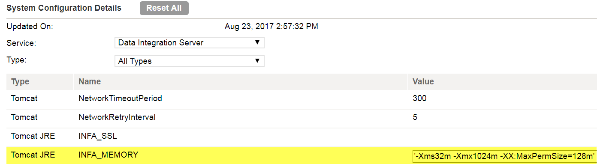

# Cannot create an Unstructured Data transformation

Without properly setting up the Secure Agent server, Hierarchy Parser and Builder do not work in the Informatica Cloud mapping designer. In this post, we will discuss how to resolve the error, ‘Cannot create an Unstructured Data transformation’ when the hierarchy data transformation mapping is performed.

There are a few things you can check.

Check 1

Make sure the UDTforHierarchy package is installed in the agent. To check this, go to Runtime Environments under the Configure tab and see Agent Package Details. If this is not enabled, contact Informatica Support.


Check 2

Increasing the Tomcat JRE INFA_MEMORY to `-Xms32m -Xmx1024m -XX:MaxPermSize=128m` sometimes help. This can be done from Edit Secure Agent.



Check 3

Make sure that you have the Linux version supported by the Secure Agent. You can get this information from Informatica Support. In RedHat, you can check the Linux kernel version and release with the command line below.

```bash
cat /proc/version
cat /etc/*release*
```

This page might be helpful for further troubleshoot.

(2017-08-25)
