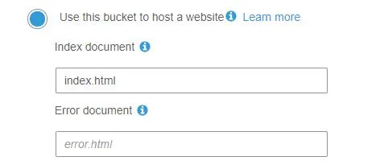
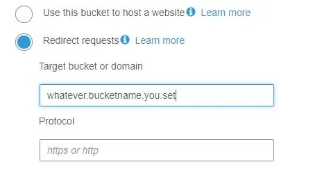
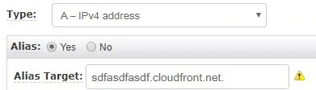
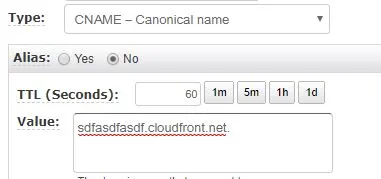

# Setting up Custom Domain Name with SSL Certificate for your S3 Website

Hosting a static website in S3 is a great way to deliver static web content to the world. Hosting a website in S3 is fairly simple. However, if you want to set up SSL certificate and your own custom domain name, you need to do a bit of configuration.

AWS already has a good documentation on setting up a static website using a custom domain and creating a CloudFront distribution with an S3 origin. Reading those documentations can be confusing. You can also deviate from what the documentation says to make this happen. For example, the name of the bucket that contains your web resources can be anything. You can also set up Route 53 record set in different ways.

As I could not find any short instruction that works, I decided to write it by myself, hoping to provide you with the quick how-to to set up CloudFront and Route 53 for your S3 website.

Relevant AWS services

CloudFront

Route 53

AWS Certificate Manager

Architecture

We are using CloudFront to distribute the static site from S3. SSL certificate is retrieved from AWS certificate manager by CloudFront. Route 53 does the custom domain routing to the CloudFront distribution.

Prerequisite

Prior to configuring everything, we assume you have Domain Name and SSL certificate. You can do both in AWS or bring your own externally. To use CloudFront, the certificate needs to be generated at US-East N. Virginia region if you are using Certificate Manager.

Registering a Domian Name with AWS

Getting SSL certificate with AWS Certificate Manager

Steps

(1) Setting up two buckets.

You need to set up two buckets. The first one is the bucket containing html, css and resource files. The name of this bucket doesn’t really matter. Enable Static website hosting. As long as Access Control List is public, you do not need to set the public bucket policy.

The second bucket needs to be the exact name of the custom domain (e.g. www.helloworld.com). Under Static website hosting, redirect request to the first bucket.

(2) Setting up CloudFront

Select Web as a delivery method. There are a few key fields that need to be configured.

Origin Settings

Origin Domain Name: This should be the static URL for web hosting, not the S3 resource name.

Origin Path: Usually index.html.

Behaviour Settings

Viewer Protocol Policy: Set to Redirect HTTP to HTTPs

Distribution Settings

Alternate Domain Names (CNAMEs): Set to the redirect bucket name (e.g. www.helloworld.com).

SSL Certificate: Choose Custom SSL certificate.

(3) Setting up Route 53

First create a Hosted Zone with your domain name (e.g. helloworld.com). Then, create a record set with the actual url (e.g. www.helloworld.com).

You can either use the CloudFront url as Alias for IPv4 Address or CNAME without Alias as below. Both work. The former is recommended and most AWS official documentation usually refer to it. It does one less DNS look up compared to CNAME.

CNAME works fine, too.

Go to your URL, it should work!

(2018-10-18)
