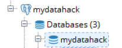

# How To Launch RDS Instance In a Specific Subnet

Let’s launch a Postgres RDS in AWS. You will get 750 hours of Amazone RDS Single-AZ db.t2.micro instance as part of 12 month free tier. You also have a bit of options (MySQL, MariaDB, or SQL Server). I am choosing Postgres here.

Amazon RDS makes it easy to set up and maintain a relational database. A few clicks of the button, you will have a fully working database. How awesome!

This is one of the steps in How To Create Your Personal Data Science Computing Environment In AWS.

According to my plan, I want to have Postgres in Subnet B from AZ2. Let’s get started.

Steps

(1) Go to RDS dashboard and click Get Started Now.

(2) Choose PostgreSQL

Tick ‘Only enable options eligible for RDS Free Usage Tier’ if you are still eligible for free tier. If you choose free tier, Multi-AZ option is not available.

(3) Set user name and password

(4) Configure advanced settings

Choose VPC and right availability zone. Once you choose the right availability zone 2, the database will be in the Subnet B according to our plan. Make sure to attach the security group we created previously (How To Configure Network Access Control Lists (NACLs) and Security Groups in AWS).

Make sure the instance is publicly accessible.

Add database name. I named it as mydatahack. Keep the default port of 5432.

(5) Connect to Postgres from your desktop.

Grab endpoint from the RDS dashboard and set up connection in your SQL client. I use pgAdmin as a client.

(6) Set up users and schemas

Now you can set up users and schemas. Check out the entry here: How To Create User Credentials And Grant Privileges In Postgres.

We now have a working Postgres RDS.

Let’s go back to How To Create Your Personal Data Science Computing Environment In AWS to complete the rest of the steps! You are almost there!

(2018-01-27)
