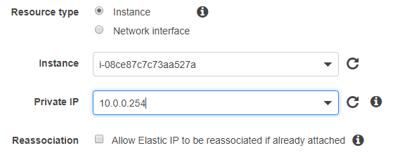
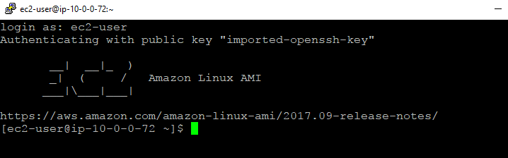

# How To Launch an EC2 Instance From AMI in AWS

Let’s launch an Linux EC2 Instance From AMI. In this example, I am launching Linux Centos 7 from Amazone Machine Image. You can choose whichever OS you want for the use case we’ve been working on here.

As a reminder, this is the plan. We are going to launch EC2 in Subnet A in availability zone 1. The public IP address is Elastic IP Address.

Big Picture

This is a step in How To Create Your Personal Data Science Computing Environment In AWS.

Steps

(1) Go to EC2 Dashboard and click Launch Instance.

(2) Go to Comminity AMIs and Search for Amazone Linux.

You will see many options. I went with amzn-ami-hvm-2017.09.1.20180115-x86_64-gp2. It is a 64 bit and EBS as a root device. You can choose whichever you like.

(3) Choose Instance Type.

You can choose the appropriate instance type. I am choosing t2.micro as it is eligible for free tier. For our use case (see here), t2.micro is not good enough as this box is for training machine learning algorithm. For the purpose of working out infrastructure set up, let’s start with t2.micro. For further information about EC2 instance type, check here.

(4) Configure Instance Details

You need to choose the correct VPC and Subnet. You also need to create the IAM role for EC2 instance with the AdministratorAccess policy. For further explanation about IAM Role, you can check out here. This can be done from Create new IAM role option.

Disable auto-assign public IP as we are using Elastic IP for this instance.

(5) Add Storage

I am going with default of 8GB SSD. If you need more storage, it is better to use Elastic Block Store. Step 10 will describe how to attache EBS volume to EC2.

(6) Add Tags

This is optional. For our use case, it is not necessary. In an enterprise environment, tagging is absolutely necessary to manage resources.

(7) Attach the existing security group

We have created a security group here (How To Configure Network Access Control Lists (NACLs) and Security Groups in AWS). Let’s attach it.

(8) Create a key pair

For SSH access to the instance, you need to create public and private key. Make sure to keep the private key file securely.

(9) Create Elastic IP address and associate it with EC2 Instance

First of all, you need to create an Elastic IP address from VPC dashboard. This step should be straight forward. Then, associate it with the EC2 you just launched.

(10) Try SSH access from desktop

Use the private key you downloaded and connect to the instance with SSH. For the host IP address, you can use the elastic IP you associated with the instance in the previous step. This should be straight forward. If you have any trouble, AWS has an extensive trouble shoot guide here.

For Amazon Linux, the user name is ec2-user for the root account.

(11) Attach EBS Volume

This is optional. Basically, you can create EBS and attach to the instance. For the details, go to this: How To Attach EBS Volume to EC2 Linux Instance In AWS.

Great! We now have a Linux server running.

Let’s go back to How To Create Your Personal Data Science Computing Environment In AWS to complete the rest of the steps!

(2018-01-27)
