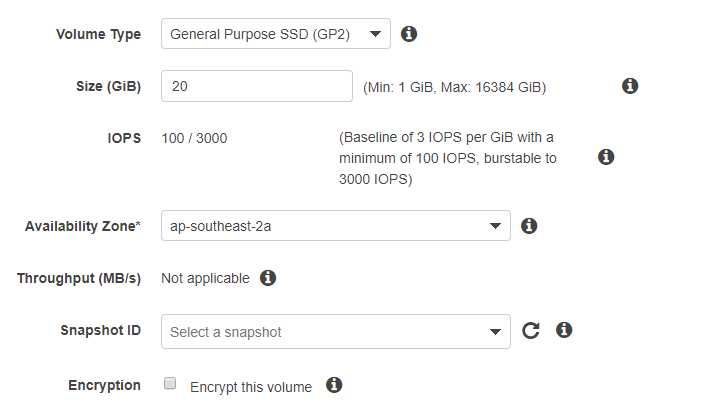
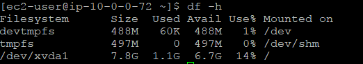
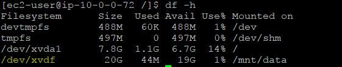

# How To Attach EBS Volume to EC2 Linux Instance In AWS

Let’s create Elastic Block Store (EBS) volume and attach it to Linux. An EC2 instance comes with a storage. But, this storage only persists with the instance. If you need to terminate the instance and start a new one, you will loose the data. If you keep the data in EBS, you can launch the new instance and simply attach the existing EBS to that instance.

This is an optional step in How To Create Your Personal Data Science Computing Environment In AWS.

As a prerequisite, you need to have a running EC2 instance. If you want to know how to launch an instance, check here (How To Launch an EC2 Instance From AMI in AWS).

This process is fun because you get to use a bit of Linux admin skills. OK, let’s begin.

Steps

(1) Create a new EBS volume

Go to EC2 dashboard and create a new volume. Choose the same availability zone as the EC2 instance. You can get up to 30 GB free EBC as part of 12-month free tier.



(2) Attach the volume to the EC2 instance

Under Actions, click attach volume and choose the right instance. Once the status turns green (in-use), it is ready to go. SSH to the instance and check to see if EBS is attached to the instance by lsblk command.


Note that the volume is not mounted to the file system. You can check it with df -h command.



(3) Create a file system with mkfs command

You need to create a file system with the mkfs command. EBS is not ready to use yet. By default, the command creates an ext2 filesystem. Although it is usable by Linux, journaling filesystem with ext4 is a better option.

`sudo mkfs -t ext4 /dev/xvdf`

(4) Create a mount point and mount the disk

Once the disk is ready for use, you can create a mount point and mount the disk.

```bash
cd /
sudo mkdir -p /mnt/data
sudo mount /dev/xvdf mnt/data
```

Here is the command for unmounting the disk in case you want to unmount it and attach to another instance.

`sudo umount -d /dev/xvdf`

(5) Check the disk



Now you can see the disk is mounted to the instance. Yay!

You can go back to How To Create Your Personal Data Science Computing Environment In AWS to complete the rest of the steps!

(2018-01-27)
