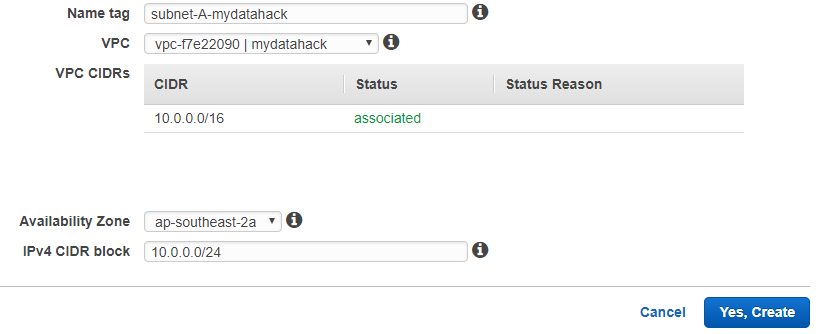
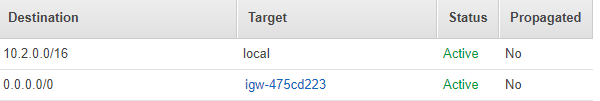
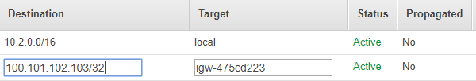

# How To Create and Configure VPC and Subnets In AWS

To create VPC, you first need to specify IP range. Each subnet takes IP range within the IP range of VPC. Before you decide the IP range, it is a good practice to plan first. You need to use CIDR notation for IP range. There is a cool tool to check the IP range of a given CIDR block and vise versa here.

This is one of the steps in How To Create Your Personal Data Science Computing Environment In AWS.

According to my plan, I have VPN that takes CIDR range of 10.0.0.0/16 (10.0.0.0 to 10.0.255.255, total of 65536 hosts).

There are two subnets. The first one takes 10.0.0.0/24 (10.0.0.0 to 10.0.0.255) in Availability Zone 1. The second one takes 10.0.1.0/24 (10.0.1.0 to 10.0.1.255) in Availability Zone 2. Make sure that the IP ranges do not overlap between them. AWS reserves five IP addresses (first four and last one) in each subnet. The first 4 IP addresses are reserved for networking purpose (like routing or local VPC DNS). The last address .255 is a broadcast address not used by AWS, so AWS reserves it. Therefore, you only get 251 IPs instead of full 256.

Once you have subnets, attach Internet Gateway to VPC and create route tables for each subnets.

Plan

Steps

(1) Go to VPC wizard from AWS Management Console.

(2) Create VPC with the correct IP range.

Specify IP range as the plan. I named my VPC as mydatahack.

(3) Create Subnet A in Availability Zone 1 and B in Availability Zone 2.

Set the CIDR range for each subnet according to the plan. 10.0.0.0/24 and 10.0.1.0/24. Choose the right VPC and Availabilty Zone. Below is the example of Subnet A.

(4) Create Internet Gateway and attach it to VPC

This part should be straight forward. Make sure to choose the right VPC.

(5) Create two route tables for both subnets in VPC

Let’s make Subnet A accessible from the Internet while Subnet B has restricted access from your computer. Default is that resources from the VPC can access to each other. Note that Subnet B has an IP address of the local computer you use. In this way, you can access to the database from your local machine. Make sure to choose the right Internet Gateway.

Subent A

Subnet B

(6) Associate Subnet to Route Table

After you create the route tables, edit the subnet associated to each route table.

Cool. Now you have VPC and Subnets. Let’s go back to How To Create Your Personal Data Science Computing Environment In AWS to complete the rest of the steps!

(2018-01-27)
