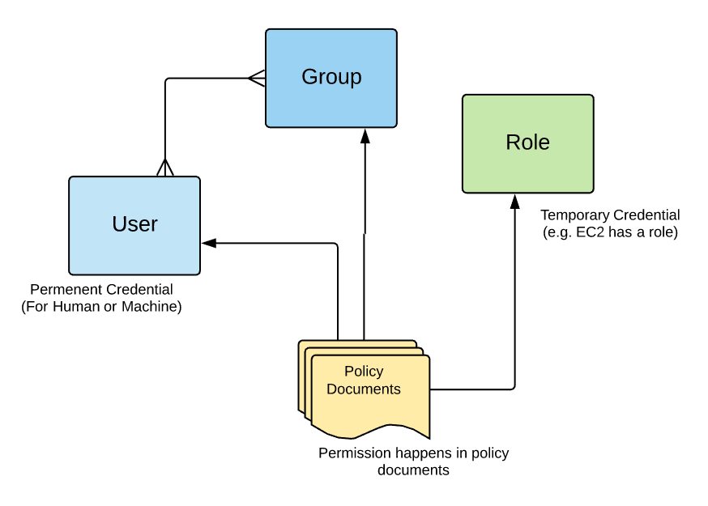
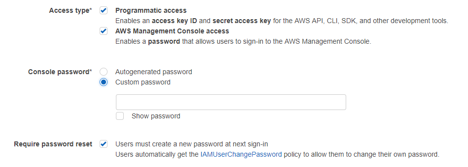
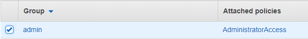

# How To Create Admin User In AWS

After you create an AWS account, the best practice is to lock away the root account credential (which you used to create the account) and never use it to do your daily tasks. Instead of using the root account, you should create an admin account with all access. To create users, user groups and policies, you can use IAM.

This entry is for Step (2) from How To Create Your Personal Data Science Computing Environment In AWS. You can check it out to get better context.

IAM Identities

IAM Identities include Users, Groups and Roles. In AWS, each has a specific meaning and understanding it correctly will help you to manage your resources.

Everything happens in AWS is triggered by API calls. Think about APIs. You first need to authenticate your self and call API. When you call API, you need to have the right permission.

Users and roles are authentication methods, not permission. Users are permanent credentials used by both humans and machines. User can be attached to groups and a group can contain many users (many-to-many relationship).

Roles are not permission. They are the temporary credentials used by resources (e.g. EC2 instance).

The permission to execute API is controlled by policy doucments. Users and roles without policy attached can authenticate themselves for API services, but cannot make any API call.

It makes sense from security point of view. If your account is compromised for whatever reason without knowing which user, you can simply detach policy from all users. Then the hackers won’t be able to execute any API.

For further information, you should check out AWS documentation on IAM here.

Once you understand IAM identities, creating user groups, users, and policies is easy.

Steps

(1) Go to IAM unser Services Tab

(2) Go to Group and click Create Group

(3) Attach Policy AdministratorAccess

(4) Go to Users and click Add user

Click both Programmatic access and AWS Management Console access. You can either set password by yourself or let IAM autogenerate it.

Make sure to get keys. This is the only time you can get them. If you miss this opportunity, there is no way to retrieve them.

(5) Attach user to the admin group with AdministratorAccess policy

(6) Review the user and complete it

Cool, now you can go back to How To Create Your Personal Data Science Computing Environment In AWS to complete the rest of the steps!

(2018-01-27)
