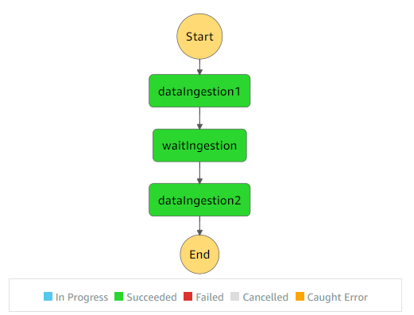

# How to Run Lambda Function Every 30 Seconds

To schedule a lambda function to run at a regular interval, we can use CloudWatch Events. The problem is that the shortest interval is 60 seconds with CloudWatch Event scheduled job. What if we want to run a function under 60 seconds interval?

Using a sleep function to loop the function during the 60 second execution is costly because we are charged with execution time and memory usage. The simplest way to do this is to use Step Functions. This is probably one of the simplest step function use case. It works beautifully.

Let’s take the example of running a lambda function every 30 seconds.

The idea is to schedule to run a step function every 60 seconds. Then, within that 60 seconds we invoke the function twice with wait of 30 seconds in between. In this way, the cost to execute lambda is lower than using sleep. The only additional cost is the state transition that occurs within the step function.

In terms of the setup, this is pretty simple. No complex retry logic that we might often use with step functions.



The config looks like this.

```json
{
  "Comment": "First Ingestion",
  "StartAt": "dataIngestion1",
  "States": {
    "dataIngestion1": {
      "Type": "Task",
      "Resource": "arn for lambda
      "Next": "waitIngestion"
    },
    "waitIngestion": {
      "Type": "Wait",
      "Seconds": 30,
      "Next": "dataIngestion2"
    },
    "dataIngestion2": {
      "Type": "Task",
      "Resource": "the same arn for the lambda as first",
      "End": true
    }
  }
}
```

If you are using serverless, I can install serverless-step-function plugin to deploy step functions. You should also install the serverless-pseudo-parameters plugin so that referring to lambda function in the config becomes easy.

Here is the config for step function that you can use in serverless.yml.

```yml
stepFunctions:
  stateMachines:
    scheduleLambda30sec:
      name: scheduleLambda30sec-${self:custom.env}
      events:
        - schedule: cron(0/1 9017 ? * MON-FRI *)

      definition:
        Comment: "Running lambda every 30 seconds"
        StartAt: lambdaExecute1
        States:
          lambdaExecute1:
            Type: Task
            Resource:
              Fn::GetAtt: [lambdaRunEvery30sec, Arn]
            Next: waitFor30sec
          waitFor30sec:
            Type: Wait
            Seconds: 30
            Next: lambdaExecute2
          lambdaExecute2:
            Type: Task
            Resource:
              Fn::GetAtt: [lambdaRunEvery30sec, Arn]
            End: true
```

That’s it. If you want to see the real example, check out the repo of my open source project, aws-lambda-template-generator. It is a command line tool to generate template project for lambda functions. These templates below are also available from this tool.

JavaScript example: https://github.com/aws-lambda-template-generator/js-step-functions-schedule-lambda-every-30sec

TypeScript example: https://github.com/aws-lambda-template-generator/ts-step-functions-schedule-lambda-every-30sec

(2020-08-28)
