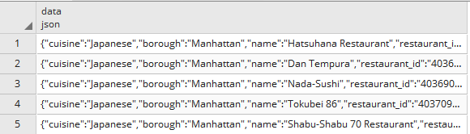
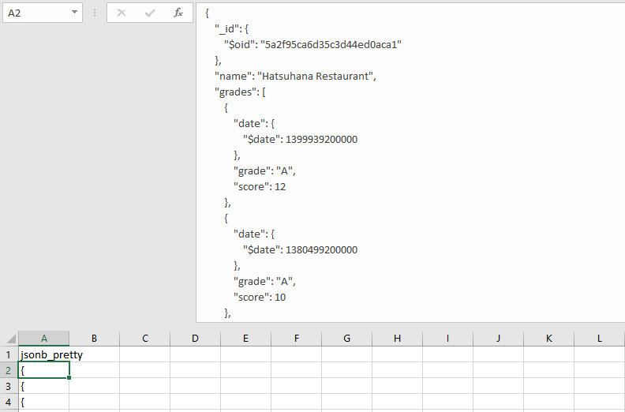

# How To Format Output in Pretty JSON With Postgres

In the previous post, we discussed the new JSON ingestion strategy by using the power of Postgres native JSON support functionality (New JSON Data Ingestion Strategy By Using the Power of Postgres). Since Postgres 9.5, it’s got a cool function jsonb_pretty() which automatically formats the output in the pretty JSON format. Before 9.5, the best way to format json was to write a function in Python or any other programming language that Postgres supports. Making JSON pretty is so much easier now!

We will use the same data set (restaurants_json) used here. You can check the post for further details.

In the restaurants dataset, let’s pick the records for Japanese Restaurant.

Pretty JSON Output

The data type for the jsonb_pretty() function is jsonb. If the data column contains the data type of json. Before using the function, you need to convert the format to jsonb.

```sql
SELECT jsonb_pretty(DATA::jsonb)
FROM  mongodb.restaurants_json
WHERE data->>'cuisine'='Japanese';
```

For the query performance, the jsonb is more recommended option. When you create a table, you should make the data type as jsonb. here is a good blog post about the difference between json and jsonb data types.

```sql
CREATE TABLE usermanaged.transaction
(
DATA jsonb
);
```

The editor does not work with multiple lines of output. So, you won’t see the pretty json format there. Once you export it into a csv file, you will see the pretty format. If you do it from a command line tool, you will see the results in the pretty format.



To export the data with pgAdmin4, you can highlight the query and press the export button highlighted in yellow.


Now, check out the pretty format!



Normal Output

Let’s compare it to the normal format.

```sql
SELECT DATA
FROM  mongodb.restaurants_json
WHERE data->>'cuisine'='Japanese';
```

When you export the data with a normal query, your data export looks like this.


Postgres is cool!

(2020-02-20)
