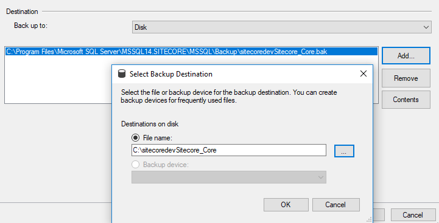

# How to Manually Create Database Backup for SQL Server

Occasionally, I need to create a database backup from SQL Server manually on demand. It is a handy thing to know. Once the backup is created, it can be loaded to other SQL Server. This often happens when a developer wants to get the database from other environment or even from other developers’ machine and loaded to their local quickly. It’s a sort of hack, but sometimes it is good enough for developers to be productive.

Super easy and simple. But, if you don’t know how to do it, it may take a bit of time googling. So, here it is. If you come across this post when you google how to create DB backup manually with SQL server, you are in luck!

Steps

(1) Pick the database from Object Explorer. Task and Back Up…

(2) Select the destination and name the backup file.

That’s it.

If you want to restore the database from the backup, you can do it from the Restore option right below the back up option in Task above.

(2019-06-12)
