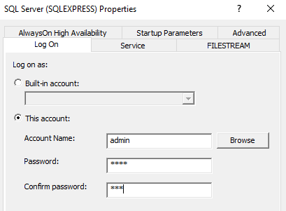

# How to Restore AdventureWorks to SQL Server Express

Once you have SQL Server Express installed on your local machine, you may want to load some example data so that you can play around with it. After all, what’s good with the database without data!

MySQL comes with the Sakila database upon installation. SQL Server’s equivalent would be AdventureWorks sample database. It doesn’t come with the default installation, but you can download the back up file and restore it.

For SQL Server 2017 Express, you should download the OLAP version of AdventureWorks2017.bak. At the bottom of the download link, it has a section called Restore backup. It explains how to restore the database from the backup file with SQL Server Management Studio.

When I first tried it from the management studio’s restore database option, nothing happened after selecting the right backup file. No error message. It looked like it worked, but no database got created.

So, I ran restore database statement to see what happens and finally got the error message: Operating System error 5 (Access is Denied) when the server was trying to access the backup file.

restore database AdventureWorks from disk = 'C:\tmp\AdventureWorks2017.bak';
Operating System error 5 (Access is Denied) is caused by the server not having right access privilege to the backup file. This is because the current SQL Server user does not have the access rights to the file. To fix this issue, you need to log on as the user with the right access to the backup file (yourself, admin and so on).

Once log on as the admin user, I was able to restore the database from the management studio UI.

(2018-11-11)
