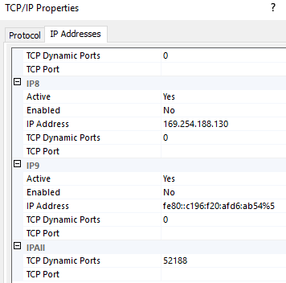
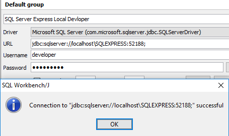

# How to Connect to Locally Installed SQL Server Express with JDBC

Once you install SQL Server Express locally, you need to go through a few configuration steps to connect to the server with JDBC.

Tools

In this demo, I am using SQL Workbench to connect to the server. SQL Server Express is 2017 version. JDBC is 7.1.x from Maven Repo.

Steps

(1) Enable TCP/IP Protocol

Go to Sql Server Configuration Manager (usually located in `C:\\Windows\SysWOW64`) and enable TCP protocol if it is not enabled. Once you enable it, you need to restart the server.

(2) Check if the port number is set

From the TCP/IP Properties above, go to the IP Address tab and scroll down to the bottom. Make sure the server is not using dynamic port. If it is, the port number is set to 0. It is usually set to 52188. The default port number for SQL Server Express is different from the default port for SQL Server, which is 1433. You can either set it to 1433 or keep it as 52188. If this is set to 52188, make sure to add port number in the JDBC connection string.

(3) Create user with password

You need to make sure SQL server enables password login. With integratedSecurity=true, you may get the error: the driver is not configured for integrated authentication. To enable user login with SQL Server Express, refer to the previous post How to Enable User Login with SQL Server Express.

(4) Configure JDBC connection string

In this example, the url string is `jdbc:sqlserver://localhost\SQLEXPRESS:52188;` You can add username and password in the string. In this case, those values are defined in the boxes below. Here is the reference for SQL Server JDBC connection string.

(2018-11-11)
