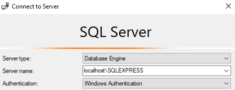
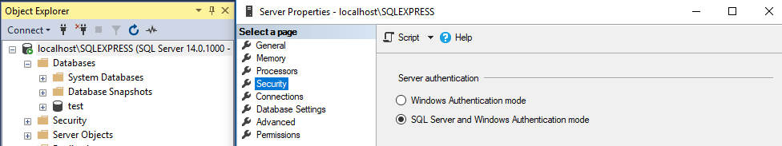
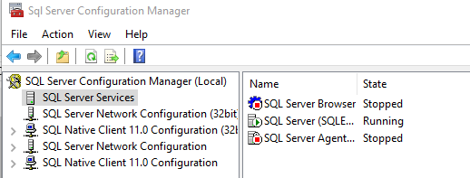
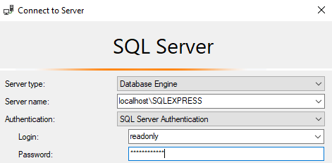

# How to Enable User Login with SQL Server Express

This post explains steps for enabling the server authentication mode (logging in with username and password) after installing SQL Server Express in your local machine. This is based on 2017 version, but it also works for older ones.

SQL Server Express comes with the default Windows Authentication mode when you first install it locally. With the Windows authentication mode, SQL Server validates a user by their Windows username and password. This means the password is not required once the user is logged into the Windows system. On the other hand, the SQL server authentication mode enables a user login which is different from Windows. This blog post is great to understand the different SQL Server Authentication mode.

Steps

(1) Create a Login User

After installing SQL Server Express and SQL Server Management Studio, you can login to the database by choosing the Windows Authentication mode. You will get the server name when you first install SQL Server Express (e.g. Server=localhost\SQLEXPRESS;Database=master;Trusted_Connection=True;).

Then, create a user with SQL Server Authentication.

Create Login readonly with Password = ';';
(2) Enable SQL Server and Windows Authentication mode

On the left panel of Management Studio, right-click the server and choose Properties. Choose Security and change Server authentication to SQL Server and Windows Authentication mode.

(3) Restart SQL Server

For the change to be effective, you need to restart SQL server from SQL Server Manager. This is usually located in C:\Windows\SysWOW64.

Start it and Stop SQL Server from SQL Server Services.

(4) Log in with SQL Server Authentication mode

You should be able to log in with the newly created username and password.

Reference

SQL Server User Management
Troubleshoot for Login failed for user error message
Restarting SQL Server Services

(2018-11-10)
