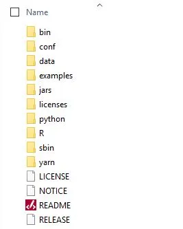
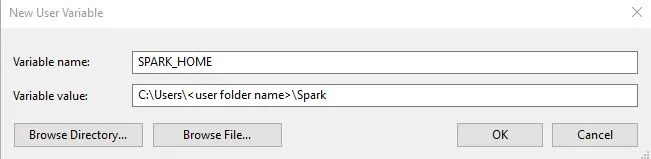
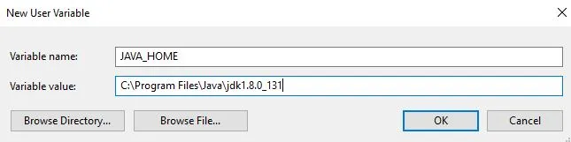
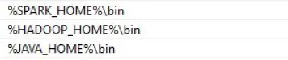
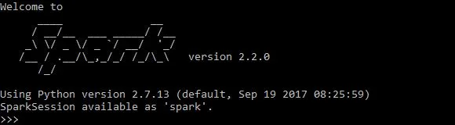

# How To Install Apache Spark On Windows

Apache Spark is a powerful framework to utilise cluster-computing for data procession, streaming and machine learning. Its native language is Scala. It also has multi-language support with Python, Java and R. Spark is easy to use and comparably faster than MapReduce. For example, you can write Spark on the Hadoop clusters to do transformation and machine learning easily.

If you have a large binary data streaming into your Hadoop cluster, writing code in Scala might be the best option because it has the native library to process binary data. For most of the Big Data use case, you can use other supported languages. In terms of machine learning, I found the performance and development experience of MLlib (Spark’s machine learning library) is very good, but the methods you can choose are limiting. However, as Spark goes through more releases, I think the machine learning library will mature given its popularity.

To play with Spark, you do not need to have a cluster of computers. You can simply install it on your machine. When I develop with Spark, I typically write code on my local machine with a small dataset before testing in on a cluster. It is also handy for debugging if you can just run it on your local machine. You can also run Spark code on Jupyter with Python on your desktop.

Spark installation can be tricky and the other web resources seem to miss steps. If you are stuck with Spark installation, try to follow the steps below. It always works for me!

Installation Steps

(1) Go to the official download page and choose the latest release. For the package type, choose ‘Pre-built for Apache Hadoop’.


To unzip .tgz file. If you have Cygwin or Git Bash, you can use the command below. Otherwise you can use WinZip or WinRAR.

`tar -xzf spark-2.2.0-bin-hadoop2.7.tgz`
(2) Create a folder called Spark under your user folder (C:\Users\<user name>\Spark) and copy and paste the unzipped content



(3) Go to the conf folder and open log file called, log4j.properties.template. Change INFO to WARN (It can be ERROR to reduce the log). This and next steps are optional.

(4) Remove .template so that Spark can read the file.


(5) Now we need to configure path. Go to Control Panel > System > Advanced System Settings. Then add SPARK_HOME in the user variable (or system variable).



(6) Add `%SPARK_HOME%\bin` to the path.

(7) Spark needs a piece of Hadoop to run. For Hadoop 2.7, you need to install winutils.exe from here.

(8) Create a folder called winutils in C drive and create a folder called bin inside. Then, move the downloaded winutils file to the bin folder.

```bash
mkdir C:\winutils\bin
```

(9) Add the user (or system) variable %HADOOP_HOME%.

If you are getting java.lang.UnsupportedClassVersionError: JVMCFRE003 bad major version, you need to define a user variable called JAVA_HOME so that Spark can use the correct version of Java.



In the end, the environment variables have 3 new paths (if you need to add Java path, otherwise SPARK_HOME and HADOOP_HOME).



(10) Create c:\tmp\hive folder and chmod on /tmp/hive folder. I don’t think this step is necessary for later versions of Spark. When you first start spark, it creates the folder by itself. However, it is the best practice to create folder and give the permission as part of installation.

```bash
mkdir C:\tmp\hive
C:\winutils\bin\winutils.exe chmod 777 /tmp/hive
```

(11) The command, ‘pyspark’ will start Pyspark. ‘spark-shell’ will start Spark with Scala.



(12) To use pyspark on Jupyter notebook, you need to set two variables and execute pyspark. The notebook will open with the spark engine.

```bash
set PYSPARK_DRIVER_PYTHON=jupyter
set PYSPARK_DRIVER_PYTHON_OPTS=notebook
pyspark
```

If you are getting 404 error with note book, check this blog.

Now, it’s time for you to spark!

(2017-12-21)
