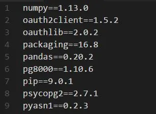

# How To Install a List of Python Packages From a Text File

Installing all the required Python packages one by one can be time consuming. When you are setting up multiple development environments or creating a virtual environment, you can have a list of Python packages in a text file and install them all together by pip.

**Steps**

(1) Create a text file called requirements.txt and list the packages you want to install as below. The number indicates the version of the packages.

(2) Go to the directory where you have your requirements.txt (below example is when you have the file in the tmp folder).

`cd /tmp/`

(3) Run the pip install command as below (sudo for Linux, not required for Windows).

`sudo pip install -r requirements.txt`

(2017-11-20)
