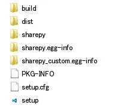
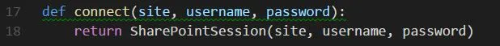
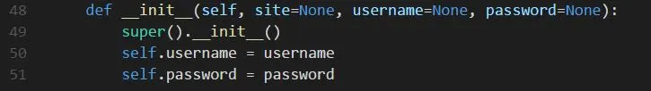
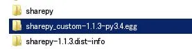

# How To Customize Python Module

What makes it even better is that these python modules are easy to customise for your need by editing the source code and recompiling it (if necessary). In this post, I will show you how to customise python modules by using the example of the sharepy module.

Sharepy handles authentication for SharePoint Online/Office365 site and allows you to make API calls. For the further details of the example of sharepoint data ingestion, have a look here.

Sharepy authentication works like this:

```python
import sharepy
s = sharepy.connect("example.sharepoint.com")
```

For initialisation, the connect method will ask you to input user name and password in the console. To deploy the code in the server, I need to include user name and password when we initialise without typing it in the console.

We want to get sharepy to initialise with user name and password parameters as below:

```python
import sharepy_custom as sharepy
s = sharepy.connect("example.sharepoint.com", , )
```

Sharepy is well documented and you can check the source code here.

Steps

(1) Download the sharepy module as a zip file from here.

(2) Unzip the file and edit name to “sharepy_custom” in setup.py.


(3) Open session.py in the sharepy folder.



(4) In line 17 and 18, add username and password in the method argument and class construction.



(5) Add username and password in the class constructor as below. Delete input in line 56 and 72.



(6) Go to the sharepy folder and run the command below.

python setup.py install
This will create a folder in your python site-packages library folder. In the screenshot, sharepy and sharepy-1.1.3.dist-info were created py pip install sharepy command. They contain the native module. Running setup.py install created the folder sharepy_custom-1.1.3-py3.4.egg, which has compiled modules with the custom code.


(7) Go into the the folder sharepy_custom-1.1.3-py3.4.egg and change the sharepy folder name to sharepy_custom. This name will be used to import the module.



Now we can import the customised module and use it as we planned!

```python
import sharepy_custom as sharepy
s = sharepy.connect("example.sharepoint.com", , )
```

Go check out how this customised sharepy is used to ingest data from Sharepoint!

(2017-11-17)
