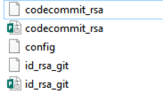

# How to Set up Dual-Authentication to GitHub and AWS CodeCommit

Both GitHub and AWS CodeCommit are used to version-control your source code. I use GitHub to share my code with the wider community and CodeCommit for production code for AWS. You may use other source control systems like BitBucket. Whatever the choice you make, it is convenient to set up your local machine to commit code to multiple Git-like code repositories.

In this post, I will show you how to set up dual-authentication to GitHub and AWS CodeCommit repositories. You can pretty much use the same way to set up Git connections to other tools. At work, I do the dual-authentication to CodeCommit and BitBucket in the same way.

Prerequisite

We assume you have AWS and BitBucket account and of course Git installed.

Steps

(1) Create SSH keys for both GitHub and CodeCommit. Use the online documentation here for GitHub and here for CodeCommit.

(2) Each SSH key pair will be created in the .ssh directory (usually located in your home directory). Name the keys so that you can differentiate them. Then, create config file as below.



(3) In the config file, you can define hosts, user ids and the paths to the private keys as below. For CodeCommit, user can be retrieved from the management console as described here. For GitHub, user is the user name.

```yml
# AWS Code Commit
Host git-codecommit.*.amazonaws.com
  User you-user-id
  IdentityFile ~/.ssh/codecommit_rsa

# Default GitHub
Host github.com
  HostName github.com
  User your-user-name
  IdentityFile ~/.ssh/id_rsa_git
```

(4) Create a repository named test_github in GitHub and test_codecommit in CodeCommit. Using UI is the easiest for GitHub. For CodeCommit, you can run AWS CLI command as below.

```bash
aws codecommit create-repository ^
--repository-name test_codecommit ^
--repository-description "test_codecommit"
```

(5) You can check the authentication in each system.

```bash
ssh -T git@github.com
ssh git-codecommit.(your aws region).amazonaws.com
```

(6) Let’s test by running the script below.

BitBucket

```bash
mkdir test_github
cd test_github
touch test.txt
echo hellogithub >> test.txt
git init
git add *
git status
git commit -m "git hub connectivity check"
git remote add origin git@github.com:(your username)/test_github
git push origin master
```

CodeCommit

```bash
mkdir test_codecommit
cd test_codecommit
touch test.txt
echo hellocodecommit >> test.txt
git init
git add *
git status
git commit -m "git hub connectivity check"
git remote add origin ssh://git-codecommit.(your region).amazonaws.com/v1/repos/test_codecommit
git push origin master
You can see the file is committed to the remote branches for both. Yay!
```

(2018-07-12)
