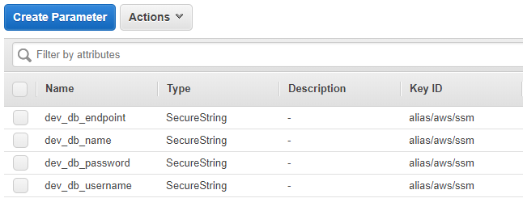

# Advanced AWS Lambda Python Function Deployment with Serverless

You can deploy lambda functions manually with hard-coded environment variables. But, that is not a good development practice. When we deploy the function to production, the deployment process eliminates the necessity of changing any input parameters or configuration. Serverless is a lambda function deployment tools that enable good development practice by automating packaging and controlling the parameters depending on which environment you are deploying.

In the previous post, I wrote a quick deployment guide with Serverless (How to Deploy Python Lambda Fnction with Serverless in AWS). The post was intended to be a quick introduction for Python lambda function deployment. Once you got the basic, it is time for us to dive into the advanced features of this amazing deployment tool.

As an example, let’s use the use case from the previous blog (Event-Driven Data Ingestion with AWS Lambda S3 to RDS). The aim is to ingest S3 data into Postgres RDS trigged by the creation of a file in the source bucket.

Improvement from the previous post

With Serveless, we can improve the manual deployment we did here. Typing lengthy AWS CLI commands is no longer necessary.

Store connection details in Parameter Store and set them as environment variables
Automatically set the permission of the function.
Recursively reference properties in the serveless.yml config file to set parameters for different environments.
Retrieve Security Group IDs and Subnet Ids depending on the environment.
Retrieve correct parameters depending on the environment.
Set the correct source bucket depending on the environment.
Set the correct deployment bucket depending on the environment.
Steps

(1) Create parameters in Parameter Store

You can create parameters from Parameter Store in EC2 dashboard or by using AWS CLI. Parameter Store is a free AWS service where you can manage your parameters (such as connection details or encryption keys).

The key point here is to set the parameter with the prefix for the target environment. For example, `dev\_` for the development environment. The correct parameter names will be used by the serverless.yml config file depending on the environment.

Let’s use AWS CLI to create parameters. The recommended approach is to encrypt the parameter with AWS managed key.

```bash
aws ssm put-parameter --name "dev_db_username" --value "db.username" --type SecureString
aws ssm put-parameter --name "dev_db_password" --value "db.password" --type SecureString
aws ssm put-parameter --name "dev_db_name" --value "db.name" --type SecureString
aws ssm put-parameter --name "dev_db_endpoint" --value "db.endpoint" --type SecureString
```

You can check your parameters in the console.



(2) Set up the correct folder structure

After running the serverless create command, you need to create a proper folder structure. You can set the folders as you like. You will be using the file path to retrieve values from different files in the main config file. My suggestion is to have a config folder with env.yml (for setting environment variable from Parameter Store) and permissions.yml (for setting permissions) with the subfolder vpc containing files for vpc parameters on different environment.


(3) Update yml files

The most important point here is that we are using -s parameter to specify which stage (dev or prod). The stage parameter is initially set to tbc, which will be overridden when you call the serverless deploy command.

serverless.yml

This is the main file. It can use the parameter within the file recursively. This is how we propagate the value for which environment. Make sure to get pythonRequirements for Python.

Names for environment, vpc, deployment bucket and source bucket will be changed depending on the environment.

service: move-s3-to-pg

```yml
custom:
  stage: ${opt:stage, self:provider.stage}
  region: ${opt:region, self:provider.region}
  env: ${opt:env, self:custom.stage}
  pythonRequirements:
    dockerizePip: linux

provider:
  name: aws
  runtime: python3.6
  memorySize: 1024
  stage: tbc
  region: ap-southeast-2
  environment: ${file(config/env.yml)}
  vpc: ${file(config/vpc/${self:custom.env}.yml)}
  iamRoleStatements: ${file(config/permissions.yml)}
  deploymentBucket:
    name: ${self:custom.env}.lambda.function.bucket
    serverSideEncryption: AES256

functions:
  hello:
    handler: handler.handler
    events:
      - s3:
        bucket: ${self:custom.env}.source.lambda
        event: s3:ObjectCreated:*

plugins:
  - serverless-python-requirements
```

env.yml

This will retrieve database connection parameters from Parameter Store. Each environment has parameters with the environment prefix.

```
ENV: ${self:custom.env}
PG_DATABASENAME: ${ssm:${self:custom.env}_db_name~true}
PG_USERNAME: ${ssm:${self:custom.env}_db_username~true}
PG_HOST: ${ssm:${self:custom.env}_db_endpoint~true}
PG_PASSWORD: ${ssm:${self:custom.env}_db_password~true}
```

permissions.yml

Adding necessary permission to the function.

```
- Effect: Allow
  Action:
    - s3:GetObject
    - s3:ListBucket
    - logs:CreateLogGroup
    - logs:CreateLogStream
    - logs:PutLogEvents
    - ec2:CreateNetworkInterface
    - ec2:DescribeNetworkInterfaces
    - ec2:DeleteNetworkInterface
  Resource: "*"
```

vpc configuration files

The file name should be the environment name (e.g. dev.yml or prod.yml). Depending on the input parameter in serverless deploy command, it will pick the right vpc configuration based on the file name as specified in the main config file, `vpc: ${file(config/vpc/${self:custom.env}.yml)}`.

```
securityGroupIds:
  - sg-xxxxxxxx
subnetIds:
  - subnet-xxxxxxxx
  - subnet-xxxxxxxx
  - subnet-xxxxxxxx
```

(4) Deploy with stage parameter

The stage parameter sets which environment the function is going to be deployed.

`sls deploy -s dev`
When you are ready for production, you can simply change the stage value.

`sls deploy -s prod`

(2018-03-17)
