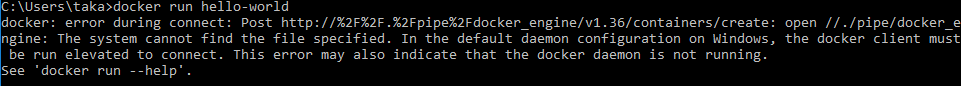
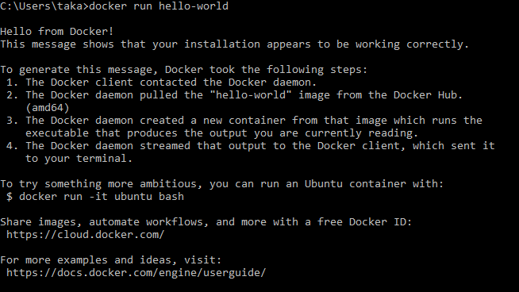

# Resolving Docker Deamon Is Not Running Error From Command Prompt

I recently installed Docker Toolbox on Windows machine (Windows 10 Home version). We all know Docker is awesome and serverless microservice architecture is hot. Docker has a better tool, called Docker for Windows. Unfortunately, this does not work with Windows 10 Home version (it works with Windows 10 Professional versions and Windows server 2016). But, once you get it working, Docker Toolbox is good for container development.

After installation, you can use Docker Quickstart Terminal, which is a MINGW64 shell, to use docker. This is all good. When I wanted to use Docker from Command Prompt, I had the docker daemon is not running error. It took me a long time to figure out how to fix this error. Hopefully, this blog helps you to resolve it quickly.

Error

When I tried to run docker run hello-world after starting the docker service, I got this error. When I went back to the docker shell to run the same command, it ran fine. Docker was run on Oracle Virtual Machine.

```
error during connect: Get http://%2F%2F.%2Fpipe%2Fdocker_engine/v1.36/info: open //./pipe/docker_engine: The system cannot find the file specified. In the default daemon configuration on Windows, the docker client must be run elevated to connect. This error may also indicate that the docker daemon is not running.
```



Resolution

First run the command below to get default environment information.

`Docker-machine env default`

Now you will see a bunch of variables. You need to set these variables by running them. This enables Command Prompt to connect to the default Docker engine.

```bash
SET DOCKER_TLS_VERIFY=1
SET DOCKER_HOST=tcp://192.168.99.100:2376
SET DOCKER_CERT_PATH=<your home path>\.docker\machine\machines\default
SET DOCKER_MACHINE_NAME=default
SET COMPOSE_CONVERT_WINDOWS_PATHS=true
```

Now, Docker runs!



This is all thanks to this post from IBM (Installing Docker Toolbox On Windows).

(2018-02-28)
