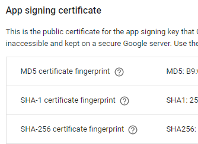

# Why Address Bar Is Not Hidden – Android App with TWA

Ok, I created my Android App by using Trusted Web Activities (TWA). I tested my app on the emulator from Android Studio and it looked all good. The app worked fine in the full-screen mode. I published my first PWA app at Google Play and everything looked fine. When I downloaded the app after the release and opened with my phone, I realised that the address bar was still there.

Because I didn’t understand how TWA works well, I started stabbing in the dark to trouble shoot this problem, including writing various JavaScript functions to make the address bar disappear or trying various configurations in styles.xml. It took me a while to figure out. If you are in the same situation as I was, this post will help.

The reason why the address bar appears is the association between the Android app and the website is not configured correctly. TWA creates this association via digital asset links. This association goes two ways. Form website to app and from app to website. Once it is configured correctly, the address bar will disappear. With TWA, you never need to write hacky JavaScript to hide the address bar.

Technically speaking, this association is done by creating .well-known/assetlinks.json in the root of the site.

If the website is generated by Jekyll as in GitHub Page, you need to add .nojekyll file (without any content) in the root folder because Jekyll doesn’t allow the folder starting with special characters (period in this case). Alternatively, you can create \_config.yml file in the root folder and add the line, include: [.well-known].

What was unclear to me was where to get sha256_cert_fingerprints value. So, I initially used App Link Assistance (under Tools option) in Android Studio to generate digital asset links file and dropped this file in the .well-known folder. This was not the correct thing to do because I chose the App Signing by Google Play option.

When App Signing by Google Play is enabled (which is the recommended option), Google will give you the sha256 certificate fingerprints which you can retrieve from the store. Go to Release management –> App signing in the right hand tool bar. Then, you will see the section App signing certificate. You have to get the SHA-256 cert fingerprint from there.



Your assetlinks.json should look like this:

```json
[
  {
    "relation": ["delegate_permission/common.handle_all_urls"],
    "target": {
      "namespace": "android_app",
      "package_name": "com.mdhsitecorequiz.sitecorecertificationexamquiz",
      "sha256_cert_fingerprints": [
        "SHA-256 certificate fingerpring in App sining cert from Google Play"
      ]
    }
  }
]
```

Once you have the correct sha256, the address bar in your app should disappear. For further information on creating asset link file can be found here.

(2019-09-14)
