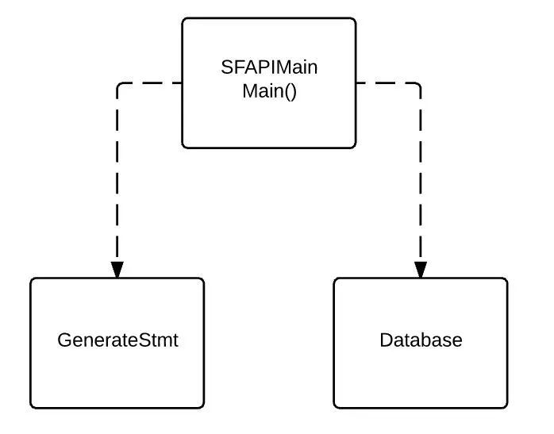

# Automate Salesforce Table Creation With Java

When you ingest data from Salesforce into a relational database, you first need to create a table for the object you want to ingest. Writing a create statement manually is cumbersome and you often need to debug it a few times. Salesforce data types are quite different from database ones. Objects sometimes have a large number of fields (like hundreds).

ETL tools often have an option to create table from Salesforce data ingestion and table creation can done when you ingest the data. However, sometimes your ETL tool does not have an option to create a table with a particular database (e.g. Informatica Cloud does not automatically create tables in Postgres).

I created a small Java application to create a table in a relational database. The example has a data type hash map for MySQL and Postgres. By editing the hash map and adding the appropriate JDBC, this should work for other databases.

Salesforce API Reference

In this post, I used REST-based API. Salesforce also supports WSDL-based SOAP API if you want to use SOAP instead. I found this document (Setting Up Your Java Developer Environment) very useful to get started with Salesforce API with Java. Using Salesforce API with Python, I recommend you to use Simple Salesforce module in my previous post.

Application Design

There are 3 classes with the main method included in the SFAPIMain class. The Database class connects to database with JDBC and execute create table statement. The GetMetaData class gets object metadata from Salesforce and converts it to a create table statement. The SFAPIMain class handles Salesforce API calls and get user input and display outcome. Make sure to build path for appropriate JDBC Jar files.



Compile it as a runnable Jar file. Enter the salesforce object and target schema, then it will create a table for you!

The program also generates a metadata csv and create table statement file. The key for this program to work is to have the correct data type mapping in the code. The only difference between MySQL and Postgres for this code to work is the data type for datetime is datetime in MySQL and timestamp in Postgres. Postgres has a data type called money. However, it is best to use decimal with scale of 2 because money type in Postgres becomes String when you query it with other BI tools. This will cause issues when you try to aggregate the field in the BI tool.

Here comes the code! Enjoy!

Code

SFPIAMain.java

```java
package SFAPIMain;

import GenerateStmt.GetMetaData;
import Database.Database;

import java.io.IOException;
import java.sql.SQLException;
import java.util.Iterator;

import javax.swing.JOptionPane;

import org.apache.http.client.methods.HttpPost;
import org.apache.http.impl.client.CloseableHttpClient;
import org.apache.http.impl.client.HttpClientBuilder;
import org.apache.http.HttpResponse;
import org.apache.http.HttpStatus;
import org.apache.http.util.EntityUtils;
import org.apache.http.client.ClientProtocolException;
import org.json.JSONObject;
import org.json.JSONTokener;
import org.json.JSONException;

public class SFAPIMain {

    static final String USERNAME = "<user name>";
    static final String PASSWORD = "<password + secret token>";
    static final String LOGINURL = "<https://test.salesforce.com or https://login.salesforce.com>";
    static final String GRANTSERVICE = "/services/oauth2/token?grant_type=password";
    static final String CLIENTID = "<Client Id>";
    static final String CLIENTSECRET = "<Client Secret>";

    static final String metaDataCsvPath = "<csv path such as metadata.csv>";
    static final String createTableFilePath = "<file path such as ddl.txt>";

    // Postgres example. Can add any JBDC as long as you compile the program with the driver.
    static final String className = "<org.postgresql.Driver>";
    static final String connectionUrl = "jdbc:postgresql://<url>:5432/<database name>";
    static final String userName = "<user name for database>";
    static final String passWord = "<password for database>";

    public static String outputMessage = "Execution Completed\n\n";

    public static void main(String[] args) throws SQLException {

        // main method will authenticate, create connection and execute methods from other classes (e.g GetMetaData.java)
        CloseableHttpClient httpclient = HttpClientBuilder.create().build();

        // Assemble the login request URL
        String loginURL = LOGINURL + GRANTSERVICE + "&client_id=" + CLIENTID + "&client_secret=" + CLIENTSECRET +
                        "&username=" + USERNAME + "&password=" + PASSWORD;
        System.out.println(loginURL);

        // Login requests must be POSTs
        HttpPost httpPost = new HttpPost(loginURL);
        HttpResponse response = null;

        // Setting Up Your Java Developer Environment Verify the REST Environment (REST-Based APIs)
        try {
            // Execute the login POST request
            response = httpclient.execute(httpPost);
        }
        catch (ClientProtocolException cpException) {
            // Handle protocol exception
            System.out.println(cpException);
            JOptionPane.showMessageDialog(null, "Client Protocol Exception on Salesforce Authentication: \n"
                                                + cpException.toString(), "EXCEPTION", JOptionPane.ERROR_MESSAGE);
        }
        catch (IOException ioException) {
            // Handle system IO exception
            System.out.println(ioException);
            JOptionPane.showMessageDialog(null, "IO Exception on Salesforce Authentication: \n"
                        + ioException.toString(), "EXCEPTION", JOptionPane.ERROR_MESSAGE);
        }

        // verify response is HTTP OK
        final int statusCode = response.getStatusLine().getStatusCode();
        if (statusCode != HttpStatus.SC_OK) {
            System.out.println("Error authenticating to Force.com:"+statusCode);
            JOptionPane.showMessageDialog(null, "Error authenticating to Force.com:"+ statusCode + "\n",
                    "EXCEPTION", JOptionPane.ERROR_MESSAGE);
            // Error is in EntityUtils.toString(response.getEntity())
            return;
        }
        String getResult = null;

        try {
            getResult = EntityUtils.toString(response.getEntity());
        }
        catch (IOException ioException) {
            JOptionPane.showMessageDialog(null, "IO Exception to get response from SF authentication:\n"+ ioException.toString(),
                    "EXCEPTION", JOptionPane.ERROR_MESSAGE);
        }

        JSONObject jsonObject = null;
        String loginAccessToken = null;
        String loginInstanceUrl = null;

        try {
            jsonObject = (JSONObject) new JSONTokener(getResult).nextValue();
            loginAccessToken = jsonObject.getString("access_token");
            loginInstanceUrl = jsonObject.getString("instance_url");
        }
        catch (JSONException jsonException) {
            JOptionPane.showMessageDialog(null, "SF Authentication Response JSON Exception:\n"+ jsonException.toString(),
                    "EXCEPTION", JOptionPane.ERROR_MESSAGE);
        }

        System.out.println(response.getStatusLine());
        System.out.println("Successful login");
        System.out.println(" instance URL: "+loginInstanceUrl);
        System.out.println(" access token/session ID:"+loginAccessToken);
        httpPost.releaseConnection();

        outputMessage = outputMessage + "Successful Salesforce login\n";
        outputMessage = outputMessage + " instance URL: " + loginInstanceUrl + "\n";
        outputMessage = outputMessage + " access token/session ID: " + loginAccessToken + "\n";
        // getMetaData("Account", loginInstanceUrl, loginAccessToken);

        // Get target object
        String targetObject = JOptionPane.showInputDialog("Enter Salesforce Object: ");
        String targetSchema = JOptionPane.showInputDialog("Enter Target Schema for table Creation: ");

        // Get metadata and parepare for create table statement
        GetMetaData getMetaData = new GetMetaData(loginInstanceUrl, loginAccessToken);
        String json = getMetaData.generateMetaData(targetObject);
        String createTableStmt = getMetaData.metaDataToCSV(json, metaDataCsvPath, createTableFilePath, targetSchema, targetObject);

        // Execute Create Table Statement
        Database mysql = new Database(className, connectionUrl, userName, passWord);
        mysql.createTable(createTableStmt, targetSchema, targetObject);

        // Preparing output message
        Iterator<String> iterator = GetMetaData.outputMessage.iterator();
        while (iterator.hasNext()) {
            outputMessage = outputMessage + iterator.next() + "\n";
        }
        Iterator<String> iterator2 = Database.outputMessage.iterator();
        while (iterator2.hasNext()) {
            outputMessage = outputMessage + iterator2.next() + "\n";
        }
        outputMessage += "Salesforce Connection has been released.";

        JOptionPane.showMessageDialog(null, outputMessage, "Outcome", JOptionPane.INFORMATION_MESSAGE);
        }
}
```

GetMetaData.java

```java
package GenerateStmt;
import java.io.FileWriter;
import java.io.IOException;
import java.io.PrintWriter;
import java.util.ArrayList;
import java.util.HashMap;

import javax.swing.JOptionPane;

import org.apache.http.HttpResponse;
import org.apache.http.client.ClientProtocolException;
import org.apache.http.client.HttpClient;
import org.apache.http.client.methods.HttpGet;
import org.apache.http.impl.client.HttpClientBuilder;
import org.apache.http.message.BasicHeader;
import org.apache.http.util.EntityUtils;
import org.json.JSONArray;
import org.json.JSONException;
import org.json.JSONObject;


public class GetMetaData {
    private static HashMap<String, String> map = new HashMap<String, String>();
    private String instanceUrl;
    private String accessToken;
    public static ArrayList<String> outputMessage = new ArrayList<String>();

    public GetMetaData(String instanceUrl, String accessToken) {
        this.instanceUrl = instanceUrl;
        this.accessToken = accessToken;
        this.map.put("id","varchar");
        this.map.put("boolean","bool");
        this.map.put("reference","varchar");
        this.map.put("string","varchar");
        this.map.put("picklist","varchar");
        this.map.put("double","decimal");
        this.map.put("phone","varchar");
        this.map.put("currency","decimal");
        this.map.put("int","int");
        // this.map.put("datetime","datetime"); // for MySQL
        this.map.put("datetime","timestamp");
        this.map.put("date","timestamp");
        this.map.put("email","varchar");
        this.map.put("multipicklist","varchar");
        this.map.put("percent","decimal");
        this.map.put("decimal","decimal");
        this.map.put("long","bigint");
        this.map.put("address","varchar");
        this.map.put("masterrecord","varchar");
        this.map.put("location","varchar");
        this.map.put("encryptedstring","varchar");
        this.map.put("textarea","varchar");
        this.map.put("url","varchar");
        this.map.put("combobox", "varchar");
    }

    public static String getColumnLength(String type, String typeConverted, String length, String precision, String scale) {
        String param = "";
        if (typeConverted == "varchar") {
            param = String.format("(%s)", length);
        }
        else if (type.equals("currency")) {
            param = String.format("(%s,%s)", precision, "2");
        }
        else if (typeConverted == "decimal") {
            param = String.format("(%s,%s)", precision, scale);
        }
        return param;
    }

    public static String setPrimaryKey(String name) {
        String param = "";
        if (name.equals("Id")) {
            param = "primary key";
        }
        return param;
    }

    public static String convertColType(String type, String length) {
        String typeConverted = "";
        if (map.containsKey(type)) {
            typeConverted = map.get(type);
                        // Used Integer.parseInt(length) >= 1000 for MySQL. For PGRES, made it to 50000
            if (typeConverted == "varchar" && Integer.parseInt(length) >= 10000) {
                typeConverted = "Text";
            }
        }
        else {
            typeConverted = "Unknown";
        }
        return typeConverted;
    }

    public String metaDataToCSV (String responseString, String filePathMeta, String filePathSQL, String schema, String targetObject) {

        String createTable = "";
        // (1) Open File
        try {
            FileWriter outFileMeta = new FileWriter(filePathMeta);
            FileWriter outFileSQL = new FileWriter(filePathSQL);
            PrintWriter outTextMeta = new PrintWriter(outFileMeta);
            PrintWriter outTextSQL = new PrintWriter(outFileSQL);

            outTextMeta.println("name,length,label,type,precision,scale");
            outTextSQL.println(String.format("Create Table %s.%s (", schema, targetObject));
            createTable = createTable + String.format("Create Table %s.%s (", schema, targetObject);
            // (2) Create JSON object
            try {
                JSONObject json = new JSONObject(responseString);
                JSONArray jsonArray = json.getJSONArray("fields");
                int fieldLength = jsonArray.length();
                System.out.println("Length of fields: " + fieldLength);
                int realFieldLength = 0;
                for (int i = 0; i < fieldLength; i++) {
                    String name = json.getJSONArray("fields").getJSONObject(i).getString("name");
                    String length = (String) json.getJSONArray("fields").getJSONObject(i).getString("length");
                    String label = json.getJSONArray("fields").getJSONObject(i).getString("label");
                    String type = json.getJSONArray("fields").getJSONObject(i).getString("type").toLowerCase();
                    String precision = (String) json.getJSONArray("fields").getJSONObject(i).getString("precision");
                    String scale = (String) json.getJSONArray("fields").getJSONObject(i).getString("scale");

                    // (3) Write to metadata csv file
                    outTextMeta.println(String.format("%s,%s,%s,%s,%s,%s", name, length, label, type, precision, scale));

                    // (4) Write Create Statement
                    String convertedType = convertColType(type, length);
                    if (convertedType.equals("varchar") && length.equals("0")) {
                        continue;
                    }
                    String columnLength = getColumnLength(type, convertedType, length, precision, scale);
                    String primaryKey = setPrimaryKey(name);
                    String separator = "";
                    if (i <= fieldLength -2) {
                        separator = ",";
                    }
                    // System.out.println(name);

                    outTextSQL.println(String.format("%s %s%s %s%s", name, convertedType, columnLength, primaryKey, separator));
                    createTable = createTable + String.format("%s %s%s %s%s", name, convertedType, columnLength, primaryKey, separator);
                    realFieldLength += 1;
                } // end of for loop
                outTextMeta.close();
                System.out.println("Number of database columns: " + realFieldLength);
                System.out.println("Meta data csv file has been generated.");
                outputMessage.add("Meta data csv file has been generated.");
                outTextSQL.println(");");
                createTable = createTable + ");";
                outTextSQL.close();
                System.out.println("Create statement has been generated.");
                outputMessage.add("Create statement has been generated.");
            } // end of json try
            catch (JSONException e) {
                e.printStackTrace();
                JOptionPane.showMessageDialog(null, "JSON Error in processing object metadata json: \n" + e.toString(),
                        "EXCEPTION", JOptionPane.ERROR_MESSAGE);
            }
        } // end of file try
        catch (IOException e) {
            JOptionPane.showMessageDialog(null, "File IO Error in generating metadata files: \n" + e.toString(),
                    "EXCEPTION", JOptionPane.ERROR_MESSAGE);
        }
        return createTable;
    }

    public String generateMetaData(String targetObject) {
        // (1) create header for get call
            BasicHeader oAuthHeader = new BasicHeader("Authorization", "OAuth " + accessToken);
            BasicHeader printHeader = new BasicHeader("X-PrettyPrint", "1");
            String jsonString = null;

            // (2) create url for api call
            String restString = String.format("/services/data/v41.0/sobjects/%s/describe/", targetObject);
            String finalUrl = instanceUrl + restString;
            System.out.println("Final URL for Rest call: " + finalUrl);
            outputMessage.add("Final URL for Rest call: " + finalUrl);

            try {
                // (3) Create httpClient and execute get request
                HttpClient httpClient = HttpClientBuilder.create().build();
                HttpGet httpGet = new HttpGet(finalUrl);
                httpGet.addHeader(oAuthHeader);
                httpGet.addHeader(printHeader);
                HttpResponse httpResponse = httpClient.execute(httpGet);

                // (4) Check response status
                int statusCode = httpResponse.getStatusLine().getStatusCode();
                if (statusCode == 200) {
                    String responseString = EntityUtils.toString(httpResponse.getEntity());
                    outputMessage.add("SF metadata call was successfully executed.");
                    // (5) Print Json data
                    try {
                        JSONObject jsonObject = new JSONObject(responseString);
                        // System.out.println("JSON result: |n" + jsonObject.toString(1));
                        jsonString = jsonObject.toString(1);
                    }
                    catch (JSONException exception){
                        exception.printStackTrace();
                        JOptionPane.showMessageDialog(null, "JSON Exception in metadata: \n" + exception.toString(),
                                "EXCEPTION", JOptionPane.ERROR_MESSAGE);
                        System.exit(-1);

                    }

                } // end of if statement when statusCode = 200

                else {
                    System.out.println("No response. Status Code: " + statusCode);
                    JOptionPane.showMessageDialog(null, "Meta Data SF call had no response. Status Code: " + statusCode
                            + "\nMost likely cause: Object does not exist.",
                            "EXCEPTION", JOptionPane.ERROR_MESSAGE);
                    System.out.println(httpResponse.getEntity().getContent());
                    System.exit(-1);
                }

            }
            catch (ClientProtocolException e) {

                e.printStackTrace();
                JOptionPane.showMessageDialog(null, "Client Protocol Error in getting metadata: " + e.toString(),
                        "EXCEPTION", JOptionPane.ERROR_MESSAGE);
                System.exit(-1);
            }
            catch (IOException e) {
                // TODO Auto-generated catch block
                e.printStackTrace();
                JOptionPane.showMessageDialog(null, "IO Error in getting metadata: " + e.toString(),
                        "EXCEPTION", JOptionPane.ERROR_MESSAGE);
                System.exit(-1);
            }
            return jsonString;
    }
}
```

Database.java

```java
package Database;

import java.sql.Statement;
import java.util.ArrayList;

import javax.swing.JOptionPane;

import java.sql.Connection;
import java.sql.DriverManager;
import java.sql.SQLException;

public class Database {

    private String className;
    private String connectionUrl;
    private String userName;
    private String passWord;
    public static ArrayList<String> outputMessage = new ArrayList<String>();

    public Database (String className, String connectionUrl, String userName, String passWord) {
        this.className = className;
        this.connectionUrl = connectionUrl;
        this.userName = userName;
        this.passWord = passWord;
    }

    public void createTable(String sql, String schema, String table) throws SQLException {
        // (1) Load JDBC Driver
        try {
            System.out.println("Loading JDBC Driver...");
            Class.forName(className);
            System.out.println("JDBC loaded successfully.");
            outputMessage.add("JDBC loaded successfully.");
        }
        catch (ClassNotFoundException e) {
            JOptionPane.showMessageDialog(null, "JBDC Class Not Found:\n"+ e.toString(),
                    "EXCEPTION", JOptionPane.ERROR_MESSAGE);
            throw new RuntimeException(e);

        }
        // (2) Connect to DB and Execute Statement
        Connection connection = null;
        Statement stmt = null;
        String dropTable = String.format("Drop Table If Exists %s.%s;", schema, table);
        try {
            System.out.println("Connecting to Database ...");
            connection = DriverManager.getConnection(connectionUrl, userName, passWord);
            outputMessage.add("Connected to Database.");
            stmt = connection.createStatement();

            // Execute Drop Table
            System.out.println(dropTable);
            int rs = stmt.executeUpdate(dropTable);
            System.out.println("Drop Table Statement has been executed. Result code: " + rs);
            outputMessage.add("Drop Table Statement has been executed. Result code: " + rs);
            // Execute Create Table
            System.out.println(sql);
            int rs2 = stmt.executeUpdate(sql);
            System.out.println("Create Table Statement has been executed. Result code: " + rs2);
            outputMessage.add("Create Table Statement has been executed. Result code: " + rs2);
            stmt.executeUpdate("Commit;");
        }
        catch (SQLException e) {
            System.out.println(e.toString());
            JOptionPane.showMessageDialog(null, "SQL Exception:\n"+ e.toString(),
                    "EXCEPTION", JOptionPane.ERROR_MESSAGE);
            System.exit(-1);
        }
        connection.close();
        outputMessage.add("DB connection Closed");
    }
}
```

(2017-11-16)
