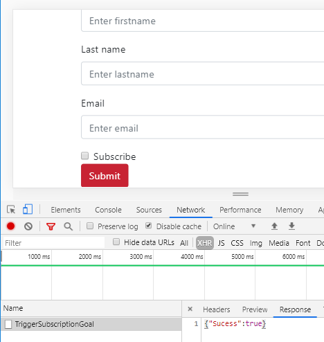
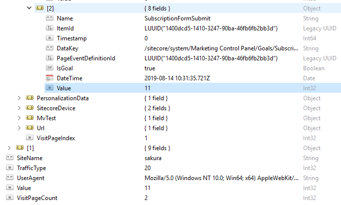

#

Sitecore has out of the box capability to record customers’ behaviours throughout their journey across the channels. We can customise the way to capture customers’ behaviours by registering our own custom events, failure events, goals and outcomes and use them to create personalisation. This out of the box analytics capability is where Sitecore really excels compared to other CMS.

Goals are typically set to a page or an action that is defined as a milestone within the sales funnel. For example, getting customer to a selection page is a milestone in the sales funnel where the end goal is conversion. Getting customer to add an item to a card is another milestone that can be captured as a goal.

They can be used for profiling and personalising content. If the customer visits more pages related to electronic goods as opposed to kitchen utensils, we can categorise them and create personalised experience on the site accordingly.

Another use of goal is to set up AB testing. We can use goal to track say which version of the form triggered submission.

In fact the goal set up here will be used for the next post about setting up content tests (How to Set up Content Tests with Data Source)

In this post, we will create a custom goal that can be triggered on form submit event by AJAX when the customer clicks a form submit button. Here are the things we need to do.

Create a new goal item and assign a value.
Create a service class to register goal.
Create an API endpoint that can be used by JavaScript to call AJAX.
Create a page with a form.
Test the solution.
Let’s get started.

Steps

(1) Create a new goal item and assign points

Go to the marketing control panel and add a new goal called SubscriptionFormSubmit. You can assign points that are associated with this goal. I added 11 points.


(2) Create a service class to register goal.

In the foundation project under Customer, I created the GoalTriggerService, which takes a goal item ID as an argument. This class can be used wherever you want to register a goal.

Make sure that you have your Tracker enabled. It is a good idea to add VisitorIdentification tag in the layout, too. Otherwise, Sitecore treats every visitor as a bot. Tracker is enabled by default, but you should check the config file just in case. See how this can be done here, Enabling tacking.

Here is the code to register goals.

```csharp
namespace SitecoreDev.Foundation.Customer.Services
{
    using Sitecore.Analytics;
    using Sitecore.Analytics.Data;
    using Sitecore.Analytics.Data.Items;
    using Sitecore.Data.Items;

    public class GoalTriggerServices : IGoalTriggerServices
    {
        public GoalTriggerServices () { }

        public bool TriggerGoal (ID goalId)
        {
            if (Tracker.Enabled)
            {
                if (!Tracker.IsActive) Tracker.StartTracking();

                var page = Tracker.Current.Session.Interaction?.PreviousPage;
                if (page != null)
                {
                    Item eventItem = Sitecore.Context.Database.GetItem(goalId);

                    var registeredGoal = new PageEventItem(eventItem);
                    var eventData = page.Register(registeredGoal);
                    eventData.Data = eventItem["Description"];
                    eventData.ItemId = eventItem.ID.Guid;
                    eventData.DataKey = eventItem.Paths.Path;

                    Tracker.Current.Interaction.AcceptModifications();
                    return true;
                }
            }
            return false;
        }
    }
}
```

(3) Create an API endpoint to trigger goal from front end

In Sitecore, we can define a custom route by adding an MVC route, which allows AJAX call to go around the Sitecore render pipeline. This involves creating route map and add some config file. It is a simple thing to do. If you need further information, you should check out the documentation, User MVC routing.

In the feature project called Subscription, first add RegisterHttpRoutes.cs in the root.

```csharp
using System.Web.Mvc;
using System.Web.Routing;
using Sitecore.Pipelines;

namespace SitecoreDev.Feature.Subscription
{
    public class RegisterHttpRoutes
    {
        public virtual void Process(PipelineArgs args)
        {
            RouteTable.Routes.MapRoute(
                "TriggerSubscriptionGoal", "Subscription/TriggerSubscriptionGoal",
                new { controller = "Subscription", action = "TriggerSubscriptionGoal" }
                );
        }
    }
}
```

Now we need to register the custom route by adding the processer to the Initialise pipeline. Create a config file, Feature.Subscription.config in App_Config/Include folder as below.

```xml
<configuration xmlns:patch="http://www.sitecore.net/xmlconfig/">
  <sitecore>
    <pipelines>
      <initialize>
        <processor
          type="SitecoreDev.Feature.Subscription.RegisterHttpRoutes,SitecoreDev.Feature.Subscription"
          patch:before="processor[@type='Sitecore.Mvc.Pipelines.Loader.InitializeRoutes, Sitecore.Mvc']"
         />
      </initialize>
    </pipelines>
  </sitecore>
</configuration>
```

The controller is simple. It’s just passing the goal GUID to a GoalTriggerService method created in step 2. The goal can be triggerd by the query string by adding the goal name on the request url. However, registering goals by their GUID is a best practice as adding query parameter with goal name can become flaky.

```csharp
using Sitecore.Data;
using Sitecore.Mvc.Controllers;
using SitecoreDev.Foundation.Customer.Services;
using System.Web.Mvc;

namespace SitecoreDev.Feature.Subscription.Controllers
{
    public class SubscriptionController : SitecoreController
    {
        private readonly IGoalTriggerServices goalTriggerServices;

        public SubscriptionController(): this(new GoalTriggerServices()) { }

        public SubscriptionController(IGoalTriggerServices goalTriggerServices)
        {
            this.goalTriggerServices = goalTriggerServices;
        }

        /// <summary>
        /// Trigger subscription form submit goal
        /// </summary>
        /// URL:
        /// http://local.sakura.com/sitecore/api/Subscription/TriggerSubscriptionGoal
        [HttpPost]
        public ActionResult TriggerSubscriptionGoal()
        {
            var subscriptionGoalId = new ID("{D5DC0014-1014-4732-90BA-46FB6FB2BB3D}");
            var goalTriggerdSuccess = this.goalTriggerServices
                                          .TriggerGoal(subscriptionGoalId);
            if (goalTriggerdSuccess)
            {
                return Json(new { Sucess = true }, JsonRequestBehavior.AllowGet);
            }
            return Json(new { Sucess = false }, JsonRequestBehavior.AllowGet);
        }
    }
}
```

(4) Create a page with a form.

Let’s use the page created in the previous post, Using Data Source in Controller Renderings. We can update the JavaScript to add a click event listener to the submit button. Yes, it is a little out of ordinary to use a multiline text field to inject JavaScript. The production solution of course should be something a little bit more robust.

```js
document.addEventListener("DOMContentLoaded", () => {
  var targetElem = $(document).find(".js-injected");
  var form = $(`<form>
      <div class="form-group">
        <label for="firstname">First name</label>
        <input type="text" class="form-control" id="firstname"
                name="firstname" placeholder="Enter firstname">
      </div>
      <div class="form-group">
        <label for="lastname">Last name</label>
        <input type="text" class="form-control" id="lastname" 
                name="lastname" placeholder="Enter lastname">
      </div>
      <div class="form-group">
        <label for="email">Email</label>
        <input type="email" class="form-control" id="email" 
                name="email" placeholder="Enter email">
      </div>
      <div class="form-check">
        <input type="checkbox" name="subscribe" 
          class="form-check-input" id="subscribe">
        <label class="form-check-label" for="subscribe">Subscribe</label>
      </div>
      <button type="submit" class="btn btn-danger submit-button">Submit</button>
    </form>`);
  form.insertAfter(targetElem);

  // Assigning click event handler
  $(".submit-button").click((e) => {
    e.preventDefault();
    var url = "http://local.sakura.com/Subscription/TriggerSubscriptionGoal";
    fetch(url, {
      method: "POST",
      mode: "no-cors",
      headers: { "Content-Type": "application/json" },
      body: "hey",
    })
      .then(function (response) {
        return response.json();
      })
      .then(function (json) {
        return json;
      })
      .catch((e) => {
        console.log(e);
      });
  });
});
```

(5) Test the solution

You cannot really test this outside of the page context as triggering a goal relies heavily on Sitecore Analytics Tracker. If you use curl to hit the endpoint, the goal registration would not be successful.

The best way to test this is to trigger it from the actual page. When you see the network tab, you can see the success message.



You can also check it in MongoDB. In the interaction collection, you can see the goal is triggered with the defined points, 11.



Yay!

Next steps
Let’s use this goal to create an AB test. Creating a content test in Sitecore is easy. Check this out: How to Set up Content Tests with Data Source)

(2019-08-14)
