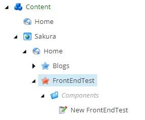
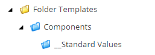
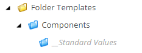

#

Creating a visual reference for Sitecore items is important for content authors as well as developers. The recommended practice (or I would say mandatory) for creating an template is to assign a distinguishable icon for easier visual reference.

If you know this trick, you can go one step further to add simple CSS style on how items appear in the content tree by using the magic of the tree node style option. The most common usage for this is styling folder templates.

As you can see, the template folder under FrontEndTest called Components is italicised with lighter font colour. Along with the folder icon, it makes the item created from folder template feel like a folder, not a real item with data.

This post will be short and sweet. Let’s get started.

First, we create a folder template called components, assign folder icon and create standard values.

Then, go to Configure tab and click Tree node style. In there, you can add extra style. Check preview to see how it looks. If you are happy, click OK.

After refreshing the page, you will see the \_Standard Values is styled.

When you create a component from this template, it will carry the style and looks like the one the first screenshot.

That’s it.

(2019-08-12)
