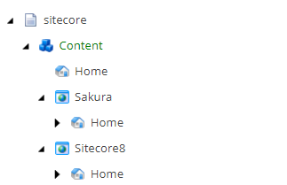
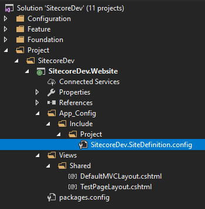

# Configuring Multiple Sites

Sitecore has the out-of-box capability to host multiple sites from a single installation. Enabling multi sites is relatively straight forward.

Sitecore decides the site context based on the incoming URL and three site attributes, hostName, virtualFolder and physicalFolder. A unique site in Sitecore is defined by hostName and those folder attributes.

To do this exercise, this documentation was very helpful. This example was done in Sitecore 8.2. In fact, multi-site configurations are the same in other versions including Sitecore 9.

Steps

(1) Update content tree in Content Editor

By default, the content node has Home where contents were served. For multiple sites, we need to create the site nodes under content. It is the best practice that each node has its own Home and all the contents are housed under it.

In the config file, we can tell Sitecore which url uses which Home location as a root.



(2) Create a config patch file in App_Config/Include

As a rule of thumb, configuration should be added by patch file. For the site definition, we can add the config file in App_Config/Include under the Project folder as below.



(3) Update the config file

Under , we can add multile sites. The name attribute can be anything you want your site to be called. The most important attributes are rootPath, contentStartItem and hostname. rootPath corresponds to the site configured in step 1.

```xml
<?xml version="1.0"?>
<configuration xmlns:patch="http://www.sitecore.net/xmlconfig/">
  <sitecore>
    <sites>
      <site name="sitecoredev" patch:before="site[@name='website']"
            virtualFolder="/"
            physicalFolder="/"
            rootPath="/sitecore/content/Sitecore8"
            startItem="/home"
            contentStartItem="/sitecore/Content/Sitecore8/Home"
            hostName="sitecoredev"
            database="web"
            domain="extranet"
            allowDebug="true"
            cacheHtml="true"
            htmlCacheSize="50MB"
            enablePreview="true"
            enableWebEdit="true"
            enableDebugger="true"
            disableClientData="false" />

      <site name="sakura" patch:before="site[@name='website']"
            virtualFolder="/"
            physicalFolder="/"
            rootPath="/sitecore/content/Sakura"
            startItem="/home"
            contentStartItem="/sitecore/Content/Sakura/Home"
            hostName="local.sakura.com"
            database="web"
            domain="extranet"
            allowDebug="true"
            cacheHtml="true"
            htmlCacheSize="50MB"
            enablePreview="true"
            enableWebEdit="true"
            enableDebugger="true"
            disableClientData="false" />

      <site name="shell">
        <patch:attribute name="contentStartItem">/</patch:attribute>
      </site>
    </sites>
    <settings>
      <setting name="Preview.ResolveSite">
        <patch:attribute name="value">true</patch:attribute>
      </setting>
    </settings>
  </sitecore>
</configuration>
```

If you are not sure about the attributes in the site node, I have a neat trick for you. First, go to /sitecore/admin/showconfig.aspx and search for sites. Above the site configuration part, you can see the comments explaining the options.


(4) Publish the config file

From the visual studio, publish the config file. Go to /sitecore/admin/showconfig.aspx to check if the site config is updated.

Note that this will restart the application as any change to web.config cause an application restart.


(5) Update host file

Go to `C:\Windows\System32\drivers\etc\hosts` and add new host names as below.

```bash
127.0.0.1              SitecoreDev
127.0.0.1             local.sakura.com
```

(6) Add Website through IIS Manager

Go to IIS Manager and add a new site. Note that two sites are using the same sitecore instance physical path.


Althernatively, we add the binding to the IIS site by PowerShell.

```bash
New-Binding -name Sakura -HostHeader local.sakura.com
```

Now, the multi-site config is ready.

Considerations

Sitecore recommends to duplicate the installation folder for each IIS site instead of each IIS site pointing to the same installation folder. Two IIS site pointing to the same web root folder will cause all sort of issues, like logging, caching and other unknow side effects (see Multiple IIS Sites). In this exercise, we did not duplicate the folders as it requires a runtime license for each site. But, this is something we should consider when we productionise multiple sites.

In this exercise, we manually wrote the configuration. In reality, it is better to use a tool like Multiple Sites Manager. It is a Sitecore module that enables you to add and configuire multiple sites from inside the Sitecore client without the needs to edit the web.config file. Note that it still requires us to update host files and IIS binding on the server.

(2019-05-23)
