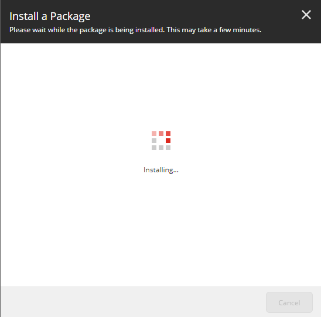
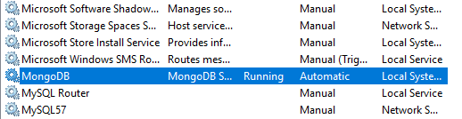

# Sitecore PowerShell Extensions Installation Hangs on Spinning Wheel – Sitecore 8.2

Sitecore PowerShell Extensions is a powerful Sitecore development tool to manage Sitecore contents, create automation jobs and do a tons of cool stuff. It brings the PowerShell scripting capabilities to deliver Sitecore solutions faster. It also has a lot of out of box tools that doesn’t require PowerShell scripting skills.

It is created by the community developers and can be installed from the market place.

When you try to install the tool, you might encounter the package installation hanging on the spinning wheel.



Solutions

Simple! You need to run your MongoDB. Without connection to MongoDB, the installation hangs.

If you haven’t installed MongoDB, here is the installation instruction. For local machine, I recommend you to run MongoDB as a service.

Running MongoDB as Windows service

(1) Setting up folders

When you install MongoDB to windows, you will create a db folder as C:/data/db. In the data folder, create config and logs folders.

```
- C:
  - data
    - db
  - config
  - logs
```

(2) Adding config file

In the data folder, create a config file as mongod.cfg and add the lines below.

```bash
logpath=C:\data\logs\mongo.log
dbpath=C:\data\db
```

(3) Setting up Mongo bin path

Add `C:\Program Files\MongoDB\Server\3.6\bin` to Environment Variable. This will enable you to run mongo commands from cmd.

(4) Install MongoDB to Windows service

Make sure that your MongoDB server is stopped. Run the command below.

`mongod --config "C:\data\config\mongod.cfg" --install`

(5) Check the service

You will see the MongoDB Service running.



(2019-04-02)
