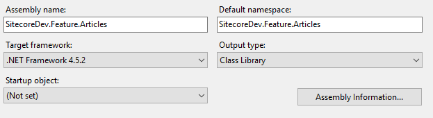

# Program does not contain a static ‘Main’ method suitable for an entry point – Sitecore 8.2

When you set up a visual studio project for Sitecore, you need to set Output type to Class Library. If it is set to Windows Application or Console Application, you need to change it to Class Library. Otherwise you get a build error below.

```bash
error CS5001: Program does not contain a static 'Main' method suitable for an entry point
```

To solve this, go to the project. Right click the project and choose Properties. Then change the Output type to Class Library.



Fixed.

(2019-03-26)
