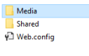

# An unhandled exception occurred Rendering Controller Error – Sitecore 8.2

This error is an interesting one because there are a few different reasons. My case was not what the error actually says.

Error in Experience Editor

```bash
Error Rendering Controller: SitecoreDev.Feature.Media.Controllers.MediaController, SitecoreDev.Feature.Media.
Action: HeroSlider: An unhandled exception occurred.
at Sitecore.Mvc.Pipelines.MvcEvents.Exception.ShowAspNetErrorMessage.ShowErrorMessage(ExceptionContext exceptionContext, ExceptionArgs args)
at Sitecore.Mvc.Pipelines.MvcEvents.Exception.ShowAspNetErrorMessage.Process(ExceptionArgs args)
at (Object , Object[] )
at Sitecore.Pipelines.CorePipeline.Run(PipelineArgs args)
at Sitecore.Pipelines.DefaultCorePipelineManager.Run(String pipelineName, PipelineArgs args, String pipelineDomain)
at Sitecore.Mvc.Pipelines.PipelineService.RunPipeline[TArgs](String pipelineName, TArgs args)
at Sitecore.Mvc.Filters.PipelineBasedRequestFilter.OnException(ExceptionContext exceptionContext)
at System.Web.Mvc.ControllerActionInvoker.InvokeExceptionFilters(ControllerContext controllerContext, IList`1 filters, Exception exception)
at System.Web.Mvc.ControllerActionInvoker.InvokeAction(ControllerContext controllerContext, String actionName)
at System.Web.Mvc.Controller.ExecuteCore()
at System.Web.Mvc.ControllerBase.Execute(RequestContext requestContext)
at Sitecore.Mvc.Controllers.ControllerRunner.ExecuteController(Controller controller)
at Sitecore.Mvc.Controllers.ControllerRunner.Execute()
at Sitecore.Mvc.Presentation.ControllerRenderer.Render(TextWriter writer)
at Sitecore.Mvc.Pipelines.Response.RenderRendering.ExecuteRenderer.Render(Renderer renderer, TextWriter writer, RenderRenderingArgs args)
```

I first observed this error in the experience editor in the controller rendering component. I googled a lot and tried out different solutions thinking the issue was to do with my controller.


Then, I thought about publishing everything and see how it looked in the actual website. This turned out to be a good move. I finally realised the error was nothing to do with my controller.


Solution

The solution is simple from the error seen from the actual website. The root cause was publishing action was not publishing cshtml in the right folder. When I went to the View folder in the web root folder, I saw the file was not in Shared or Media folder.


The quick fix was to create a Media folder and move cshtml into it. The long term solution would be to fix the publishing process so that the cshtml gets placed in the right location.



(2019-03-23)
