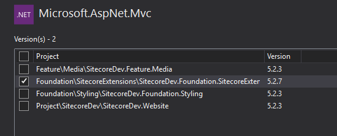

# How to resolve Could not load file or assembly System.Web.Mvc Error – Sitecore 8.2

When I refactored an existing Sitecore 8.2 project into the Helix structure, I had a server error in ‘/’ application when I first tried to get into the sitecore admin console. This type of error is usually simple to fix. It means the version of dll in the bin folder of the web root folder is different from the one in the config file.

The fix is not complicated, but it took me a bit to figure out why this was happening. So, I am going to document the steps I took to trouble shoot this.

Error message

```bash
Parser Error Message: Could not load file or assembly 'System.Web.Mvc, Version=5.2.3.0, Culture=neutral, PublicKeyToken=31bf3856ad364e35' or one of its dependencies.
The located assembly's manifest definition does not match the assembly reference. (Exception from HRESULT: 0x80131040)

Source Error:
Line 142:
Line 143:
Line 144:
Line 145:
Line 146:

Source File: C:\Inetpub\wwwroot\Sitecore\Website\web.config    Line: 144
```

Trouble shooting steps

(1) Check the version of the package across the projects

Go to Tools -> NuGet package manager -> Manage Nuget Packages for Solution… -> select Installed tab ->click Microsoft.AspNet.Mvc

There you go, one of the projects was using 5.2.7 version while others are using 5.2.3.



(2) Check the log

When I checked the log file in the Data folder in the web root folder, Sitecore was loading 5.2.7 version of System.Web.Mvc.dll.

```bash
3672 23:32:26 INFO  c:\inetpub\wwwroot\sitecore\website\bin\system.web.mvc.dll
(Microsoft ASP.NET MVC, System.Web.Mvc.dll, 5.2.7-61128 (39d3064baf13181f5718ec5d85ba644b47d0704b))
```

(3) Re-install the correct version

Uninstall the existing package, select the right version and install.


(4) Republish the project

Go to reference of the project in the Visual Studio, right click System.Web.Mvc, select property and make sure Copy Local is set to true. This will ensure that the package will be published to the web root.

If this doesn’t work, you can go into the bin folder of the web root folder and physically delete System.Web.Mvc.dll and republish the project.

Now the error is gone.

Hurray!


(2019-03-21)
