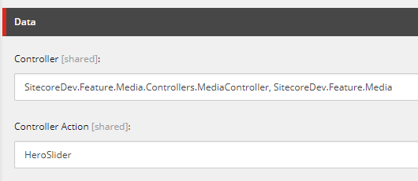

# Could not create controller Error for Controller Renderings – Sitecore 8.2

ASP.NET standard controller action routing is {controller}/{action} (see here). When you create a new project, you will see this in RouteConfig.cs file in the App_Start folder.

Sitecore has overridden this standard route registration procedures. Routing to controller and action can be determined by the controller rendering component. This makes sense as Sitecore page typically has multiple controller renderings. When you create a visual studio solution, it is best to delete App_Start folder along with RouteConfig.cs so that you don’t override the Sitecore’s route registration.

As a side note, it also best to delete Global.asax file so that you do not override the one comes with Sitecore installation.

The way sitecore finds the way to controller/action is defined in the rendering. Once you create a rendering, you can add the controller and controller action in the data section as below.

Controller can be just the name of the controller like Media. But, if you have the visual studio project set up as Helix, you want to have:

ProjectName.Controllers.ControllerClassName, AssemblyName



Now, enough background. Let’s talk about the error.

If the Sitecore cannot find the path for controller and action, you will get the error below. There are three possible reasons and fixes.

Error

```bash
Error Rendering Controller: SitecoreDev.Feature.Media.MediaController, SitecoreDev.Feature.Media.
Action: HeroSlider: Could not create controller: 'SitecoreDev.Feature.Media.MediaController, SitecoreDev.Feature.Media'.
The item being rendered is: '/sitecore/content/Home/MyPage'. The context item is: '/sitecore/content/Home/MyPage'.
The current route url is: '{*pathInfo}'.
This is the default Sitecore route which is set up in the 'InitializeRoutes' processor of the 'initialize' pipeline.

   at Sitecore.Mvc.Controllers.SitecoreControllerFactory.CreateController(RequestContext requestContext, String controllerName)
   at Sitecore.Mvc.Controllers.ControllerRunner.GetController()
   at Sitecore.Mvc.Controllers.ControllerRunner.Execute()
   at Sitecore.Mvc.Presentation.ControllerRenderer.Render(TextWriter writer)
   at Sitecore.Mvc.Pipelines.Response.RenderRendering.ExecuteRenderer.Render(Renderer renderer, TextWriter writer, RenderRenderingArgs args)

Inner Exception: The controller for path '/' was not found or does not implement IController.
   at System.Web.Mvc.DefaultControllerFactory.GetControllerInstance(RequestContext requestContext, Type controllerType)
   at System.Web.Mvc.DefaultControllerFactory.CreateController(RequestContext requestContext, String controllerName)
   at Sitecore.Mvc.Controllers.SitecoreControllerFactory.CreateController(RequestContext requestContext, String controllerName)
```

Solution 1

You might have overridden Sitecore’s route registration procedures by publishing the project with default RouteConfig.cs for a standard ASP.NET project. Delete the file and republish the project. Alternatively, delete the dll of the project from the web root bin folder and republish the project after deleting RouteConfig.cs.

Solution 2

Your configuration for Controller is not correct. Follow the convention above.

Solution 3

Your controller class is inheriting Controller as the base class. Instead import Sitecore.Mvc.Controllers and use SitecoreController.

```csharp
using Sitecore.Mvc.Controllers;

public class MediaController : SitecoreController
```

See how you go!

(2019-03-23)
