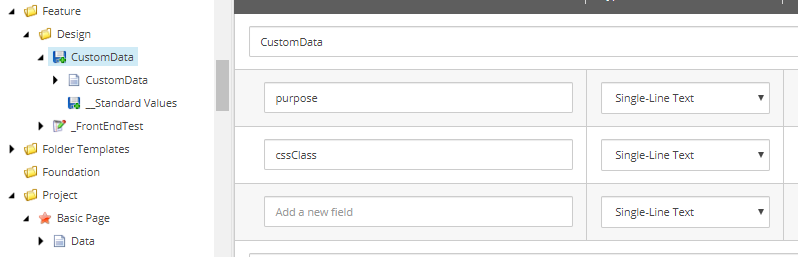
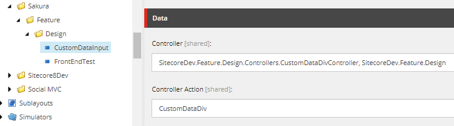
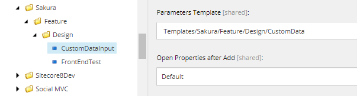
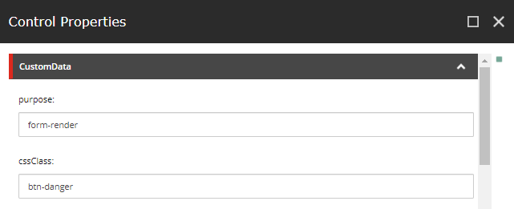
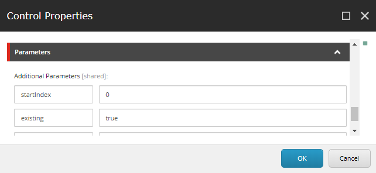
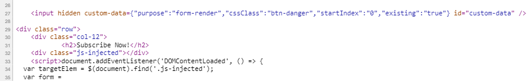
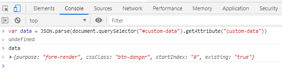

# Using Rendering Parameters to Inject Data into Hidden Input – Sitecore

What are rendering parameters? They are the additional key-value pair data you can feed to the Sitecore component in addition to data source. The textbook example would be adding an additional CSS class to the component. Content authors can customise the style of the component, like background colour or button style, which in turn makes the component more reusable.

You can set rendering parameters either on the standard values of the template or content items or in Experience editor while editing the content.

The keys of rendering parameters can be defined by creating a parameter template. Alternatively, it can freewheel as you can type the key value pair in the Parameters section in Control Properties of the component.

The cool thing about rendering parameters is that you can mix both ways. No matter how many parameters you add, they are still stored in database as a query string and accessed by Sitecore API, RenderingContext.Current.Rendering.Parameters. The custom RenderingParameters object is like a dictionary. You can loop through by foreach and accessed by .Key and .Value.

By leveraging the nature of rendering parameters, let’s do something experimental. What if we create a component that takes all the parameters as a dictionary object and inject it into a hidden input as custom data. In this way, JavaScript can read these custom parameters to do unique behaviours depending on what is defined as parameters.

Can we create a reusable component to inject a hidden input with custom data? Yes, we can and that is exactly what we are going to build.

This is the component output.

```html
<input hidden custom-data={ "purpose":"form-render", "cssClass": "btn-danger",
"startIndex": "0", "existing": "true" } id="custom-data" />
```

**Steps**

We need to create templates, controller rendering and add parameters. We will get to the coding part later.

(1) Create parameter template

First, let’s create parameter template. Make sure to inherit from Templates/System/Layout/Rendering Parameters/Standard Rendering Parameters.



(2) Create Controller Rendering

Let’s reference to the correct controller & action.



Then, scroll down to find the Parameter Template section and add the path to the template we created in step 1.



(3) Add Controller Rendering to the page template

Now, we can add the component created above to the page template.


(4) Add parameters in Control Properties of the component

You will see it at the top of Control Properties of the component.



Alternatively, it can be defined as typing the key value pair in the Parameters section in Control Properties of the component. Let’s add some.



Now, it’s time to code.

(5) Code!

Coding is fairly straight forwards. But, it is fun. Check this out.

Model

This is a simple model with one dictionary field that has all the parameters stored as dictionary.

```csharp
using System.Collections.Generic;

namespace SitecoreDev.Feature.Design.Models
{
    public class CustomDataDiv
    {
        public Dictionary<string, string> CustomData { get; set; }
    }
}
```

View

It takes the dictionary and serialise it as Json. Then, inject it into custom-data attribute in the hidden input.

```csharp
@model SitecoreDev.Feature.Design.Models.CustomDataDiv
@using System.Web.Script.Serialization;

@if (Model != null)
{
    var json = new JavaScriptSerializer().Serialize(Model.CustomData);
    <input hidden custom-data=@Html.Raw(@json) id="custom-data" />
}
```

Controller

Using Sitecore API to get parameters, passing it to a repository method to create a model and returning the view with the model.

```csharp
using SitecoreDev.Feature.Design.Repository;
using Sitecore.Mvc.Presentation;
using Sitecore.Mvc.Controllers;
using System.Web.Mvc;

namespace SitecoreDev.Feature.Design.Controllers
{
    public class CustomDataDivController : SitecoreController
    {
        private readonly ICustomDataDivRepository customDataDivRrepository;
        private readonly RenderingParameters parameters;

        public CustomDataDivController() : this(new CustomDataDivRepository()) { }

        public CustomDataDivController(ICustomDataDivRepository repository)
        {
            this.customDataDivRrepository = repository;
            this.parameters = RenderingContext.Current?.Rendering?.Parameters;
        }

        public ActionResult CustomDataDiv()
        {
            var data = this.customDataDivRrepository
                .GetParamsForCustomDiv(parameters);
            return View(data);
        }
    }
}
```

Repository

Takes parameters and converting it into a dictionary object.

```csharp
using Sitecore.Mvc.Presentation;
using SitecoreDev.Feature.Design.Models;
using System.Collections.Generic;

namespace SitecoreDev.Feature.Design.Repository
{
    public class CustomDataDivRepository : ICustomDataDivRepository
    {
        private readonly CustomDataDiv model;

        public CustomDataDivRepository()
        {
            this.model = new CustomDataDiv();
        }

        public CustomDataDiv GetParamsForCustomDiv(RenderingParameters parameters)
        {
            this.model.CustomData = new Dictionary<string, string>();
            foreach (var param in parameters)
            {
                model.CustomData.Add(param.Key, param.Value);
            }
            return model;
        }
    }
}
```

That’s it!

(6) Test the component

You can check the source to see if it exists.



See if you can access the data by JavaScript.



It works!

Yay!

**Next Step**

Now that we’ve got a cool component, we can write unit tests. It is easy and quite fun. Check out the next post: How to Mock Rendering Parameters in Unit Test

(2019-08-16)
