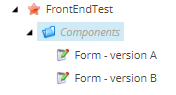
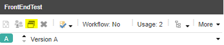
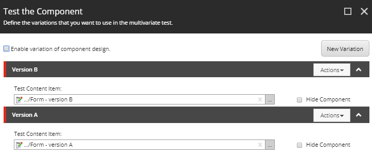
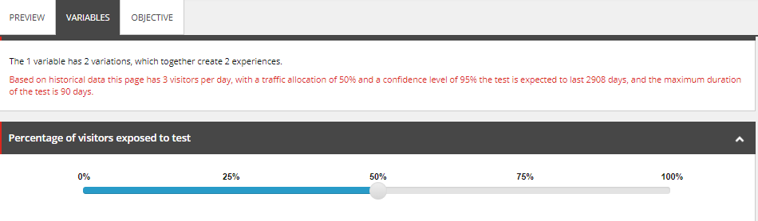
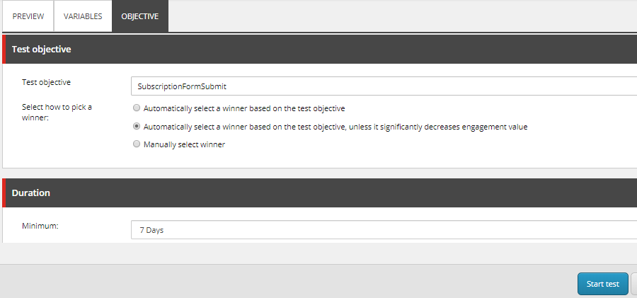
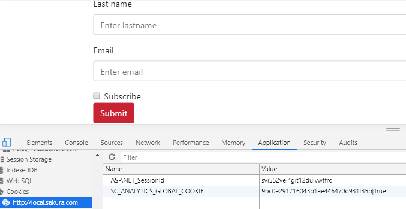
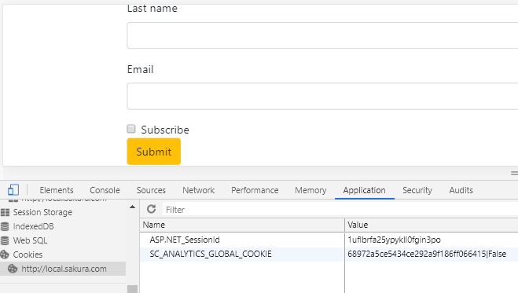

# How to Set up Content Tests with Data Source

Setting up AB tests or even multivariate tests in Sitecore is simple as long as the page is implemented correctly. The key to easily create AB tests is to components.

There are a few ways of setting up tests in Sitecore. In this post, let’s create tests by using data source. We are using the components created in the previous blog as well as the goals. This post is built on the previous two entries.

Prerequisites

As it is build on the development done in the previous posts, I recommend you to have a look at them.

– Using data source in controller renderings

– How to configure custom goals and trigger them by AJAX call

Scenario

We have two forms. Form A has placeholders in the input field with btn-danger submit button. Form B does not have placeholders and btn-warning submit button. We will present these forms 50/50 to users to see which one has better submission rate.

Here is the summary solution. We will got into the details next.

Steps

(1) Add variations as data source item

First of all, we need to add two different data source items. This component was created in the previous post.

(2) Configure AB test

When the component is using data source, you will see the test component option by clicking the component.

In the pop up window, create a new variation from the data source.

You will see the message banner – New has been added. Do components you want to create a test? Click create test. You will see the two different version of the component in the preview tab.

Go to the variable tab to set 50-50 split. You can also set confidence level. Higher value requires more data.

In the Objective tab, let’s set the goal. It is a custom goal created in the previous post, triggered by clicking submit button. Once the goal is set, hit the start test button. Then, you can publish the page.

(3) Testing content test setup

Sitecore tracks visitors (either anonymous or known) by dropping an unique id, SC_ANALYTICS_GLOBAL_COOKIES in the cookies. To test variations, you need to clear cookies each time you refresh the page. You will see different variations in 50-50 chance.

After clearing the cookie & refreshing the page, you see the different variation in 50-50 chance. You can see the vale for the unique id is different from the one above.

The test results can be checked through the experience editor’s test results option or analytics dashboard. The caveat is that these reports are using aggregated xDB data and it runs a batch job every 15 minutes. You can change the speed if you want to see the results faster for testing.

Sitecore has a detailed official documentation on how to interpret the results – Content test results. For further details on creating content tests, check out this official documentation – Creating and running tests.

I have not configured for xDB processing to run faster. This will put more burden on my local machine. So, after doing the test, I waited for about 15 minutes. Then, the results started to coming to the dashboard. As you can see, the goal is triggered correctly in both versions. The reason why the goal % is more than 100 is that I submitted form multiple times on the same session.

Data is coming through. I looks good. Yay!

Tips

Here are some tips on setting up tests.

Every time we cancel the test, it is better to add a new version and create test.
Creating test on Experience Editor is slow. Be patient.
Page publishing usually has a workflow. You can use the workflow to add the step called approved with test. Out of the box sample workflow already has this step, so you can refer to it.
If you are caching the component, the test do not show variation. Make sure to untick caching.
Make sure to use incognito browser and clear cookie to check variations.
Final thoughts

It is great that Sitecore has the out of the box capability to set up content tests. Setting up tests can be done without development effort as long as the content is componentised and goal is available. It looks relatively simple at first and sounds like a good idea.

In reality, setting up tests in experience editor is too slow and frustrates business users. If we want to set up hundreds of tests, the slowness becomes a limiting factor. There are techniques to make Experience editor run faster, but no. It is still too slow.

As the users are getting more and more familiar with the BI dashboard, the analytics dashboard feels too primitive and lacks a lot of information that marketers want. It is also not very intuitive to use. Do we need to log into production Sitecore console every time you need to check AB tests results? If you are running content tests on hundreds of pages, how can keep track of all the results?

My opinion is that it is better to avoid doing content tests in Sitecore beyond POC with a few simple scenarios. In fact, the only time you set up content tests in Sitecore is when the client insists to use Sitecore capability to do the tests and you want to prove them it is not as good as what Sitecore has been selling them. There are better tools out there that can do so much more than what Sitecore offers. I have worked with Optimizely, which uses JavaScript to override the content. After working with Sitecore content testing, the tool is miles ahead. It is easy to create and manage a large number of tests and its analytics dashboard is great.

All in all, content testing is more agile and pleasant with front-end based tools. Sitecore will not satisfy today’s needs for content testing. But, if you decided to go with it, hopefully this post helps you to set up your tests in Sitecore.

(2019-08-15)
