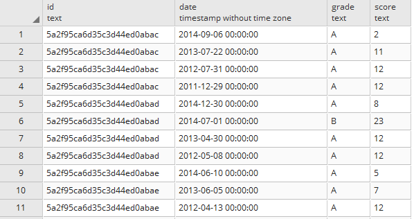

# New JSON Data Ingestion Strategy by Using the Power of Postgres

Postgres always had a JSON support with somehow limited capability before the 9.2 version added the native JSON support. The release of version 9.3 has really taken the JSON feature to the next level with additional constructor and extractor methods. The capability of querying and transforming the JSON data type with Postgres gives you the new strategy to ingest JSON data from APIs or NoSQL databases.

To ingest JSON into a data warehouse, we traditionally use a programming language or ETL tool to transform JSON into a structured table format and upload it into a database table. When you think about it, this is not efficient. JSON is schema-less while the database table requires strictly defined schema. This makes transformation cumbersome especially when the schema often changes per record. Any change in the source JSON structure also requires additional development effort.

The ability to query and transform native JSON data type with Postgres enables us to load the JSON file as it is and use SQL to query or transform later. In this way, you can just adjust the query as new business requirement comes without further development effort.

Postgres has two data types for JSON, json and jsonb. For query, I recommend to use jsonb because it is simply faster and can be indexed for complex queries (see indexing in postgres here). The json data type stores data in a row format while jsonb stores data in a custom binary format. But, what does it mean? The json data type needs to load and parse the entire JSON blob each time while jsonb does not need to parse the entire JSON blob every time you query it. In a nutshell, jsonb is optimised for queries. For further detail, there is a good blog post here.

Well, let’s check out how it works!

Example

Let’s use the same dataset from the previous example where we ingested JSON data from MongoDB How to get data from MongoDB with Python.

In that example, we first pulled the data and transformed into a structured format with Python. Instead of transforming it, we can load each record directly into Postgres as it is. Then, we can use SQL to create the structured data.

In some sense, the way we ingested data in How to get data from MongoDB with Python is a traditional way of creating structured tables from Json. Using the same will make it a good comparison between two methods.

In the previous post, we ingested the restaurant collection like below to create structured tables. Here, we will basically replicate it except that the final output is views of those two tables.

Record Example


Data Model


Table Creation

Each row corresponds to a JSON record. We only need one column with the data type of jsonb.

```sql
CREATE TABLE mongodb.restaurants_json (

DATA jsonb

);
```

Data Load

We will use Python to insert JSON record into the table. I can present two different approaches. The first approach is to query the data from MongoDB and insert the record one by one. The second approach is to write the ingested data into a flat file and call copy command. When you do a bulk upload, this approach is faster.

If you need to have a recap on how to ingest MongoDB data, you can refer to How to get data from MongoDB with Python.

Whatever approach you take, you need to have a table with all the JSON records loaded in one column as below.


**Approach 1: Insert**

This is pretty straight forward. Note that if you have ‘ in the dataset, you will get an error. I replaced it with `<>`. As the record is inserted one by one, this takes longer than the bulk upload from a flat file.

```python
mongo_uri = 'mongodb://<user>:<pw>@<uri>:27017/test'
connection_string = "dbname='<dbname>' user='<user>' host='<uri>' password='<pw>'"
table_name = 'mongodb.restaurants_json'
import pymongo
from pymongo import MongoClient
import psycopg2
from bson.json_util import dumps

def get_data(uri):
    mongo_uri = uri
    client = MongoClient(mongo_uri)
    db = client.test
    restaurants = db.restaurants
    print('Total Record for the collection: ' + str(restaurants.count()))
    return restaurants

def pg_insert(connection_string, table_name, collection):
    try:
        conn = psycopg2.connect(connection_string)
        print("Connecting to Database")
        cur = conn.cursor()

        cur.execute("Truncate {} Cascade;".format(table_name))
        print("Truncated {}".format(table_name))

        for record in collection.find():
            record = dumps(record)
            cur.execute(("INSERT INTO {} VALUES ('{}')".format(table_name, str(record).replace("'", "<>"))))
            cur.execute("commit;")

        print("Inserted data into {}".format(table_name))
        conn.close()
        print("DB connection closed.")
    except Exception as e:
        print('Error {}'.format(str(e)))

pg_insert(connection_string, table_name, get_data(mongo_uri))
```

**Approach 2: Bulk Upload**

Each record is a row written as a long string. Once the file is generated, use copy_expert() to upload the file. It seems `WITH CSV Quote e’\x01’ Delimiter e’\02’` works the best for the copy command. I was getting a lot of errors without these conditions.

```python
mongo_uri = 'mongodb://<user>:<pw>@<uri>:27017/test'
connection_string = "dbname='<dbname>' user='<user>' host='<uri>' password='<pw>'"
table_name = 'mongodb.restaurants_json'
file_path = '/tmp/restaurants_json.csv'
import pymongo
from pymongo import MongoClient
import psycopg2
from bson.json_util import dumps

def write_json(uri, file_path):
    mongo_uri = uri
    client = MongoClient(mongo_uri)
    db = client.test
    restaurants = db.restaurants
    print('Total Record for the collection: ' + str(restaurants.count()))

    f = open(file_path, 'w')

    for record in restaurants.find():
        record = dumps(record)
        f.write(record + '\n')
    f.close()

def pg_load(connection_string, table_name, file_path):
    try:
        conn = psycopg2.connect(connection_string)
        print("Connecting to Database")
        cur = conn.cursor()

        f = open(file_path, "r")

        cur.execute("Truncate {} Cascade;".format(table_name))
        print("Truncated {}".format(table_name))
        cur.copy_expert("copy {} FROM STDIN WITH CSV quote e'\x01' delimiter e'\x02'".format(table_name), f)
        cur.execute("commit;")
        print("Loaded data into {}".format(table_name))

        conn.close()
        print("DB connection closed.")
    except Exception as e:
        print('Error {}'.format(str(e)))

write_json(mongo_uri, file_path)
pg_load(connection_string, table_name, file_path)
```

**Create Views With Postgres JSON Functions**

Once the table is loaded, real fun begins! We can simply write SQL to query and transform the JSON records. The way we query JSON with Postgres is to map the key to the value with `->` or `->>` operators.

There are only a few things you need to know to get it started. Make sure that you understand how to map key to the value and the difference between `->` and `->>` (`->` returns JSON object and `->>` returns text) because the data type is important to use other JSON functions.

`jsonb_array_elements()` is the God-sent function which expands array into multiple rows. If we are to do this transformation in a programming language, we have to use loop. This function makes querying nested JSON so much easier. Note that the function takes only jsonb data type, not string. Therefore, use `->` to get the array from the key.

It is probably a good idea to read this tutorial first to get the idea. For further reference, I always use Postgres documentation here. I am using a few string functions. Here is the reference.

Main Table (Restaurant_VW)

```sql
CREATE VIEW mongodb.restaurants_vw AS
SELECT
    SUBSTRING(DATA ->> '_id', 11, 24) AS id,
    DATA -> 'address' ->> 'building' AS address_building,
    REPLACE(split_part(DATA -> 'address' ->> 'coord', ',', 1), '[', '') AS address_coord1,
    REPLACE(split_part(DATA -> 'address' ->> 'coord', ',', 2), ']', '') AS address_coord2,
    DATA -> 'address' ->> 'street' AS address_street,
    DATA -> 'address' ->> 'zipcode' AS address_zipcode,
    DATA ->> 'borough' AS borough,
    DATA ->> 'cuisine' AS cuisine ,
    DATA ->> 'name' AS name,
    DATA ->> 'restaurant_id' AS restaurant_id
FROM mongodb.restaurants_json;
```

Child Table (Grades_VW)

```sql
CREATE VIEW mongodb.grades_vw AS
SELECT
    SUBSTRING(DATA ->> '_id', 11, 24) AS id,
    to_timestamp(
    split_part(
        translate(jsonb_array_elements(DATA -> 'grades') ->> 'date', '{}', '')
        , ': ', 2)::BIGINT / 1000
    ) at TIME zone 'UTC'
    AS DATE,
    jsonb_array_elements(DATA -> 'grades') ->> 'grade' AS grade,
    jsonb_array_elements(DATA -> 'grades') ->> 'score' AS score
FROM mongodb.restaurants_json;
Now check out the view! We have the same output with the traditional method described here. I think this is more flexible and easier when you have JSON file changing dynamically and business requirements are changing fast. If you are using Postgres, I would definitely recommend you to try it.
```

`Select * From mongodb.restaurants_vw;`


`Select * From mongodb.grades_vw;`



(2018-02-16)
